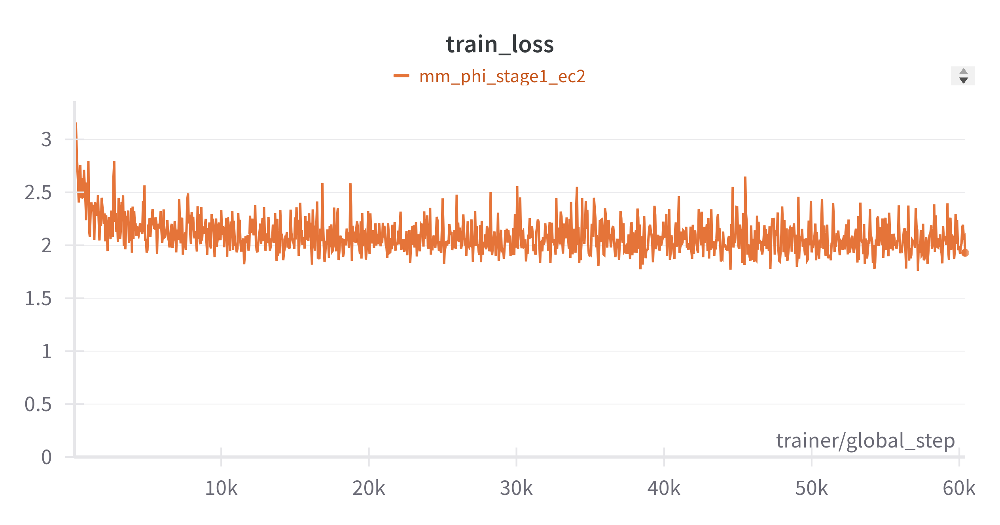
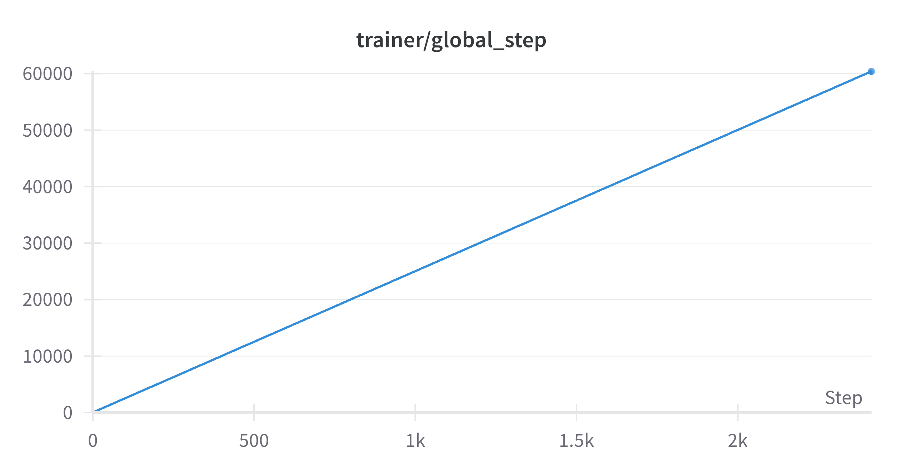
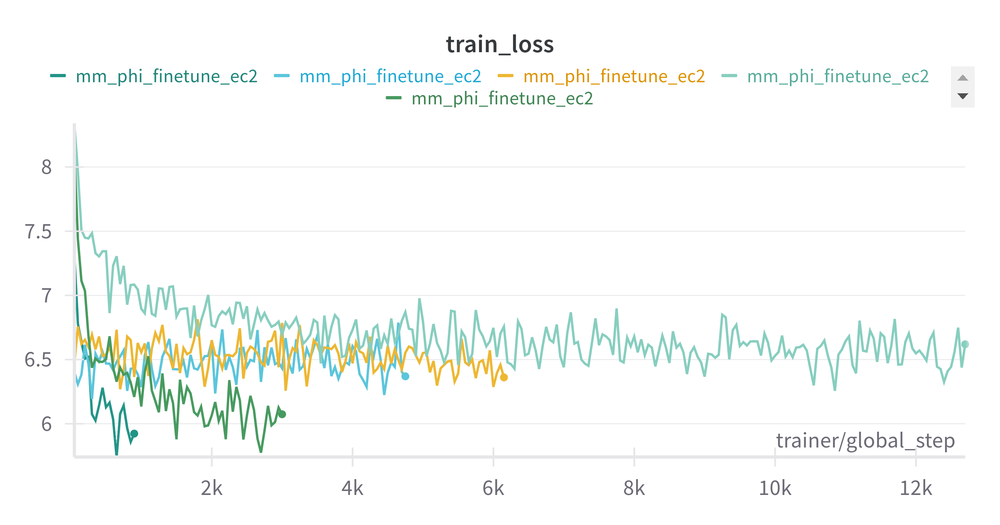
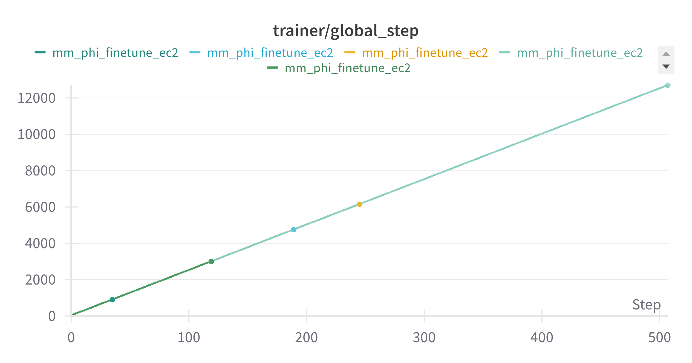
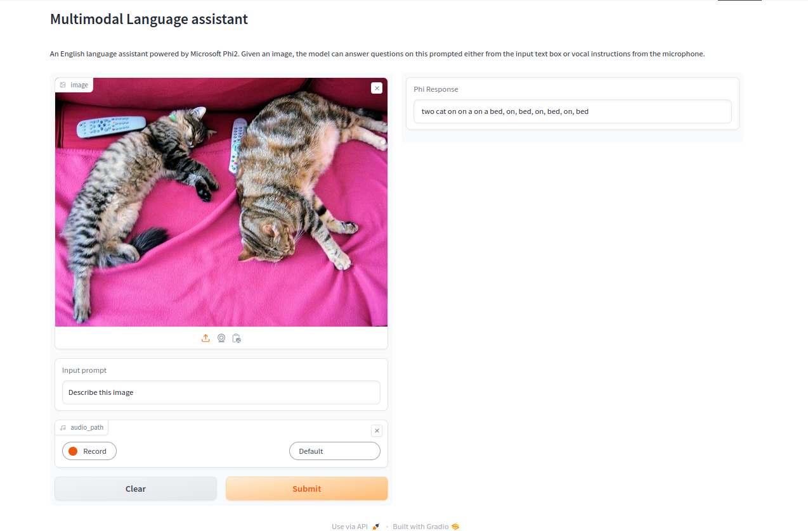

# Training a MultiModal GPT from scratch

In this project, we pretrain the Microsoft Phi model from scratch and then fine tune it as a multimodal language assistant i.e, the user can upload an image, and give a text prompt or an audio prompt to ask questions about the image and the model should be able to answer this.


# Stage 1 Pretrain:
In the pretraining step, we pretrain a [Pythia](https://github.com/EleutherAI/pythia) model using the [Red Pajama](https://github.com/Lightning-AI/lit-gpt/blob/main/tutorials/pretrain_redpajama.md) dataset. 
We use the [LitGPT](https://github.com/Lightning-AI/lit-gpt/blob/main/README.md) repo to perform this. 

We only train it till the loss has reduced and demonstrate that given more GPU resources, we can continue to fully pretrain this model. Below are the training logs for this pretraining:

```
iter 0 step 1: loss 10.9833, LR: 0.000000, iter time: 1964.85ms (optimizer.step)
iter 100 step 101: loss 7.0670, LR: 0.000300, iter time: 625.12ms (optimizer.step)
iter 200 step 201: loss 6.1442, LR: 0.000600, iter time: 672.23ms (optimizer.step)
iter 300 step 301: loss 6.3695, LR: 0.000900, iter time: 663.85ms (optimizer.step)
iter 400 step 401: loss 6.4042, LR: 0.001200, iter time: 659.47ms (optimizer.step)
iter 500 step 501: loss 5.9287, LR: 0.001500, iter time: 656.67ms (optimizer.step)
iter 600 step 601: loss 6.1363, LR: 0.001800, iter time: 655.95ms (optimizer.step)
```
 
 # Stage 2: Finetuning LLM 
 ## Training an image Projection Layer:
For the 2nd stage, we finetune the [Microsoft Phi 2](https://huggingface.co/microsoft/phi-2) model as our AI Assistant that can see an image, and answer any question we pose either as a text prompt, or as an audio input.

We want our LLM to be able to understand an image before it can answer questions. However, conventional LLMs use tokenized text as input. In order to pass an image as input, we need to compute image embeddings and then transform the image embeddings to the text embedding dimension that the LLM is trained for. 

We use a pretrained [CLIP](https://huggingface.co/docs/transformers/model_doc/clip) model to encode the image into an embedding vector of size 50 x 768 with the first vector indicating the classification. However, the embedding dimension of the Phi model is 2560. So we need to first train a projection layer that transforms the image embedding dimension from 768 to 2560. This is done by freezing the LLM model, the clip model, and only training the projection layer. Given an input image, we first compute the image embeddings, and then train the projection layer so that the LLM predicts the caption. The input to the projection layer is 49 x 768 and the output is 49 x 2560. For this step, we use the [COCO 2017 dataset](https://cocodataset.org/#home). 

The pretraining was done for a total of ~60000 steps on an AWS EC2 instance with 24GB GPU memory. The plots below show the training loss and the step number. 



Below is a snapshot of some validation examples from the training run.

```
*****************************************
  94    caption: A green and yellow train on a pair of train tracks
  95  predicted: A train with a red and white livery is parked on a track.
  96 Epoch 0:   7%|███▏                                            | 8000/118187 [33:50<7:46:03,  3.94it/s, v_num=71kv, train_loss=2.310, train_loss_auto=1.700]
  97 Epoch 0:   6%|██▊                                             | 7010/118187 [29:51<7:53:36,  3.91it/s, v_num=71kv, train_loss=2.010, train_loss_auto=1.580]
  98 Epoch 0:   6%|███                                             | 7510/118187 [31:52<7:49:41,  3.93it/s, v_num=71kv, train_loss=2.010, train_loss_auto=1.570]
  99    caption: A person on skis being watched by a crowd of people.                                                                   | 0/100 [00:00<?, ?it/s]
 100 The attention mask and the pad token id were not set. As a consequence, you may observe unexpected behavior. Please pass your input's `attention_mask` to obtain reliable results.
 101 Setting `pad_token_id` to `eos_token_id`:50256 for open-end generation.
 102 The attention mask and the pad token id were not set. As a consequence, you may observe unexpected behavior. Please pass your input's `attention_mask` to obtain reliable results.
 103 Setting `pad_token_id` to `eos_token_id`:50256 for open-end generation.
 104  predicted: A group of people skiing down a mountain
 105 *****************************************
 106    caption: A couple of giraffes eating leaves from trees.
 107  predicted: A group of animals are grazing in a field.
 108 Epoch 0:   8%|███▋                                            | 9000/118187 [38:01<7:41:18,  3.94it/s, v_num=71kv, train_loss=2.030, train_loss_auto=1.920]*****************************************
 109 Epoch 0:   7%|███▎                                            | 8010/118187 [34:03<7:48:22,  3.92it/s, v_num=71kv, train_loss=2.070, train_loss_auto=1.630]
 110 Epoch 0:   7%|███▍                                            | 8510/118187 [36:03<7:44:41,  3.93it/s, v_num=71kv, train_loss=1.960, train_loss_auto=1.820]
 111 The attention mask and the pad token id were not set. As a consequence, you may observe unexpected behavior. Please pass your input's `attention_mask` to obtain reliable results.
 112 Setting `pad_token_id` to `eos_token_id`:50256 for open-end generation.
 113    caption: Young man engaging breaking wave while surfing in ocean.                                                               | 0/100 [00:00<?, ?it/s]
 114  predicted: A man surfing on the waves of the ocean.
 115 The attention mask and the pad token id were not set. As a consequence, you may observe unexpected behavior. Please pass your input's `attention_mask` to obtain reliable results.
 116 Setting `pad_token_id` to `eos_token_id`:50256 for open-end generation.
 117 *****************************************
```

## Finetuning the LLM with QLORA
After training the projection layer, we need to finetune the LLM to be able to answer questions from the images. For this, we use the [Llava Instruct 150k] (https://huggingface.co/datasets/liuhaotian/LLaVA-Instruct-150K) dataset, which is based on COCO 2017 dataset but also contains pairs of questions and answers. 

TO finetine the Phi model, we follow the [QLORA](https://huggingface.co/blog/4bit-transformers-bitsandbytes) finetuning strategy. In this, we finetune the projection layer, along with the attention blocks in the Phi model. The flow is as follows:

1. An image and question/answer pair are passed as training inputs
2. The CLIP embeddings of the image are computed, and are projected through the projection layer to get the image embeddings of shape (49 x 2560)
3. The question is tokenized and the text embeddings are computed from the LLM. 
4. The image embeddings and the text embeddings are concatenated and passed to the LLM for predicting the answer
5. The output of the LLM is the answer to the question. 
6. The training loss is calculated as the cross entropy between the predicted answer and the ground truth from the dataset.

This model was finetuned on an Amazon EC2 instance with a GPU of 24 GB for ~20 hours with a learning rate of 1E-4. The training had to be restarted due to several interruptions in the connection. The plots below show the training loss and the training steps of the finetuning stage.




Despite training for so long, the model has not fully learnt to answer the questions. I believe that by optimizing the learning rate and with more training, the model will improve. 

## Adding Audio as input prompt
The final piece of the multimodal assistant is integrating audio to the flow. The user can upload an image and ask a question related to the image and the model should be able to answer this. 

The first step for this process is to transcribe the audio input to text. We use the [WhisperX](https://github.com/m-bain/whisperX) model to do this processing. The transcribed text is then tokenized and passed to the LLM. Below are the process steps:

1. The user uploads an image and gives an input audio prompt from the microphone
2. The audio is processed using the WhisperX model and translated to text. 
3. The text is tokenized and text embeddings calculated.
4. The image embeddings, along with the text embeddings are passed to the LLM. The LLM model should predict the answer to the text.

# Building a Huggingface space for the Multimodal assistant  
The final step is to put everything together to a web application on Hugging face. This model supports both text and audio prompts.
 [Here](https://huggingface.co/spaces/jvaddi/Multi_Modal_Chat_Assistant) is the link to huggingface space. The image below shows a snapshot of the hugging face spaces app running



## Description of code and python scripts
### Projection layer training
* [main_pretrain.py](https://github.com/jyanivaddi/ERA_V1/blob/master/Capstone/main_pretrain.py) sets up and trains the projection layer using COCO17 dataset.
* [dataset.py](https://github.com/jyanivaddi/ERA_V1/blob/master/Capstone/dataset.py) defines the dataset for projection layer training
* [model_pretrain.py](https://github.com/jyanivaddi/ERA_V1/blob/master/Capstone/model_pretrain.py) contains model definitions to train the projection layer

### Finetuning the projection layer and LLM
* [main_finetune.py](https://github.com/jyanivaddi/ERA_V1/blob/master/Capstone/main_finetune.py) sets up and finetunes the projection layer and the Phi model using QLORA strategy.
* [llava_instruct_dataset](https://github.com/jyanivaddi/ERA_V1/blob/master/Capstone/llava_instruct_dataset.py) defines the dataset for the finetuning the model with Q&A.
* [model_finetune.py](https://github.com/jyanivaddi/ERA_V1/blob/master/Capstone/model_finetune.py) contains model definitions to finetune the projection layer and LLM.

### Stage 1 pretraining
* [Part_1/main.ipynb](https://github.com/jyanivaddi/ERA_V1/blob/master/Capstone/Part_1/main.ipynb) contains the code to pretrain an LLM. 

### Hugging face space
* [app.py](https://huggingface.co/spaces/jvaddi/Multi_Modal_Chat_Assistant/blob/main/app.py) contains the code to define and build the HuggingFace spaces app for this project
* [utils.py](https://huggingface.co/spaces/jvaddi/Multi_Modal_Chat_Assistant/blob/main/utils.py) contains support functions for the huggingface spaces app.


# Potential improvements to the model
Despite training the model for several hours (~ 30 hours for both pretraining and finetuning combined), the model is not giving optimal predictions and the training loss has plateaued. Maybe by training the model further or by experimenting with the learning rate, the model would train better.

Instead of using a constant learning rate, another strategy is to have a learning rate scheduler to regulate the learning better. 

Additionally, the projection layer can be further optimized by adding a residual connection in addition to the simple linear block that is currently in place. 

