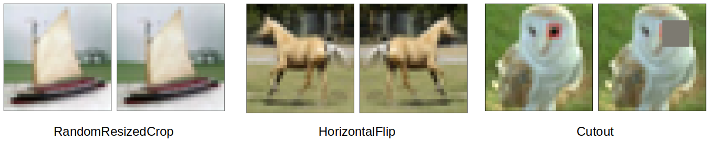

# ERA V1 Session 10 - Custom Resnet for CIFAR10 image classification

## Contents
* [Introduction](#Introduction)
* [Dataset](#Dataset)
* [Model](#Model)
* [Optimizer and Scheduler](#Back-Propagation)
* [Results](#Results)
* [Learnings](#Learnings)

# Introduction
In this module, we build a custom resnet model to perform image classification on CIFAR-10 dataset. With this model, we show that by using OnecycleLR scheduling policy, we can achieve a **90.3%** test accuracy within __24__ training epochs for this dataset. We take inspiration from [this](https://myrtle.ai/learn/how-to-train-your-resnet-8-bag-of-tricks/) blog post to build our model. 

# Dataset
The dataset we use in this notebook is called **[CIFAR-10](https://www.cs.toronto.edu/~kriz/cifar.html)**. This dataset consists of 60000 RGB images of size 32 x 32. There are a total of 10 classes and 6000 images per class. There are 50000 training images and 10000 test images. we set the batch size to 512 during training so there are 98 batches of images per epoch. 

The images below show some representative images from the dataset


The following images show few more samples, along with their labels


## Image Augmentations using Albumentations library
Image augmentations are used in order to increase the dataset size and as a way of inproving model regularization. By transforming the dataset arbitrarily we ensure that the network does not memorize the train dataset. In our model, we use  [Albumentations](https://albumentations.ai/) library for implementing various image augmentations. The library contains several augmentation methods and it seamlessly integrates with Pytorch. 

The three different image transformation methods we use in this model are:

* [HorizontalFlip](https://albumentations.ai/docs/api_reference/full_reference/#albumentations.augmentations.geometric.transforms.HorizontalFlip): This method randomly flips an image horizontally 
* [RandomResizedCrop](https://albumentations.ai/docs/api_reference/full_reference/#albumentations.augmentations.crops.transforms.RandomResizedCrop): This method shifts, scales, or rotates the image 
* [Cutout](https://albumentations.ai/docs/api_reference/full_reference/#albumentations.augmentations.dropout.coarse_dropout.CoarseDropout): This method randomly cuts out a square of size 8 x 8 in the image. 

The below image demonstrates how the image transforms look on a sample image



# Model
We build a resnet style architecture for this classification model. We have a total of 4 blocks in this network. A prep layer, followed by two resnet blocks, followed by the output block. Here is a descriotion of the blocks:

* __Prep layer__: This is a single convolution with kernel size 3, stride 1 and padding of 1 to keep the output dimensions same. This is followed by a batch normalization, a ReLU activation function, and drop out regularization.
* __Residual Block__: Residual blocks provide the ability for the model to achieve multiple receptive fields so that objects of various sizes can be easily detected. This is achieved by adding skip connections to the convolution blocks. In the resnet model, a skip connection is added after two successive convolutions. i.e., the output of a convolution block is added to the output of two convolution blocks away. This helps the network to feed the smaller features deeper in the network. Prior to adding skip connections, a pooled convolution is added to reduce the feature size.
* __Output Block__: In the output block, a max pooling layer is applied to make the feature size 1. The outputs are then expanded with a fully connected layer which outputs 10 channels that feed into a softmax function.

Here is a summary of the model we used to perform classification. The table below is generated using the python package [torchinfo](https://pypi.org/project/torchinfo/) This provides a mode intuitive and detailed model summary than the torchsummary package. The model definition is implemented as a fully modular code [here](https://github.com/jyanivaddi/ERA_V1/blob/master/session_10/custom_resnet/custom_resnet.py).

```
=====================================================================================================================================================================
Layer (type:depth-idx)                   Kernel Shape              Input Shape               Output Shape              Param #                   Mult-Adds
=====================================================================================================================================================================
CustomResnet                             --                        [1, 3, 32, 32]            [1, 10]                   --                        --
├─Sequential: 1-1                        --                        [1, 3, 32, 32]            [1, 64, 32, 32]           --                        --
│    └─Conv2d: 2-1                       [3, 3]                    [1, 3, 32, 32]            [1, 64, 32, 32]           1,728                     1,769,472
│    └─BatchNorm2d: 2-2                  --                        [1, 64, 32, 32]           [1, 64, 32, 32]           128                       128
│    └─ReLU: 2-3                         --                        [1, 64, 32, 32]           [1, 64, 32, 32]           --                        --
│    └─Dropout: 2-4                      --                        [1, 64, 32, 32]           [1, 64, 32, 32]           --                        --
├─Layer: 1-2                             --                        --                        --                        --                        --
│    └─Sequential: 2-5                   --                        [1, 64, 32, 32]           [1, 128, 16, 16]          --                        --
│    │    └─Conv2d: 3-1                  [3, 3]                    [1, 64, 32, 32]           [1, 128, 32, 32]          73,728                    75,497,472
│    │    └─MaxPool2d: 3-2               2                         [1, 128, 32, 32]          [1, 128, 16, 16]          --                        --
│    │    └─BatchNorm2d: 3-3             --                        [1, 128, 16, 16]          [1, 128, 16, 16]          256                       256
│    │    └─ReLU: 3-4                    --                        [1, 128, 16, 16]          [1, 128, 16, 16]          --                        --
│    │    └─Dropout: 3-5                 --                        [1, 128, 16, 16]          [1, 128, 16, 16]          --                        --
│    └─ResidualBlock: 2-6                --                        --                        --                        --                        --
│    │    └─Sequential: 3-6              --                        [1, 128, 16, 16]          [1, 128, 16, 16]          147,712                   37,748,992
│    │    └─Sequential: 3-7              --                        [1, 128, 16, 16]          [1, 128, 16, 16]          147,712                   37,748,992
├─Sequential: 1-3                        --                        [1, 128, 16, 16]          [1, 256, 8, 8]            --                        --
│    └─Conv2d: 2-7                       [3, 3]                    [1, 128, 16, 16]          [1, 256, 16, 16]          294,912                   75,497,472
│    └─MaxPool2d: 2-8                    2                         [1, 256, 16, 16]          [1, 256, 8, 8]            --                        --
│    └─BatchNorm2d: 2-9                  --                        [1, 256, 8, 8]            [1, 256, 8, 8]            512                       512
│    └─ReLU: 2-10                        --                        [1, 256, 8, 8]            [1, 256, 8, 8]            --                        --
│    └─Dropout: 2-11                     --                        [1, 256, 8, 8]            [1, 256, 8, 8]            --                        --
├─Layer: 1-4                             --                        --                        --                        --                        --
│    └─Sequential: 2-12                  --                        [1, 256, 8, 8]            [1, 512, 4, 4]            --                        --
│    │    └─Conv2d: 3-8                  [3, 3]                    [1, 256, 8, 8]            [1, 512, 8, 8]            1,179,648                 75,497,472
│    │    └─MaxPool2d: 3-9               2                         [1, 512, 8, 8]            [1, 512, 4, 4]            --                        --
│    │    └─BatchNorm2d: 3-10            --                        [1, 512, 4, 4]            [1, 512, 4, 4]            1,024                     1,024
│    │    └─ReLU: 3-11                   --                        [1, 512, 4, 4]            [1, 512, 4, 4]            --                        --
│    │    └─Dropout: 3-12                --                        [1, 512, 4, 4]            [1, 512, 4, 4]            --                        --
│    └─ResidualBlock: 2-13               --                        --                        --                        --                        --
│    │    └─Sequential: 3-13             --                        [1, 512, 4, 4]            [1, 512, 4, 4]            2,360,320                 37,749,760
│    │    └─Sequential: 3-14             --                        [1, 512, 4, 4]            [1, 512, 4, 4]            2,360,320                 37,749,760
├─MaxPool2d: 1-5                         4                         [1, 512, 4, 4]            [1, 512, 1, 1]            --                        --
├─Linear: 1-6                            --                        [1]                       [10]                      5,120                     51,200
=====================================================================================================================================================================
Total params: 6,573,120
Trainable params: 6,573,120
Non-trainable params: 0
Total mult-adds (M): 379.31
=====================================================================================================================================================================
Input size (MB): 0.01
Forward/backward pass size (MB): 4.65
Params size (MB): 26.29
Estimated Total Size (MB): 30.96
=====================================================================================================================================================================
```

# Optimizer and Scheduler
For this model, we use an [Adam optimizer](https://pytorch.org/docs/stable/generated/torch.optim.Adam.html) for implementing back propagation. Adam optimizer uses a per-parameter learning rate unlike stochastic gradient that uses a single learning rate for all the parameters. We use a [Cross Entropy](https://pytorch.org/docs/stable/generated/torch.nn.CrossEntropyLoss.html) as loss function. 

In order the schedule the learning rate, and to achieve faster convergence, we use [OnecycleLR](https://pytorch.org/docs/stable/generated/torch.optim.lr_scheduler.OneCycleLR.html) scheduler. First proposd by [Leslie Smith](https://arxiv.org/abs/1708.07120), this method works by first increasing the LR to a high value in the initial few epochs, followed by a gradually decreasing trend. The high learning rate helps the model to reach closer to the global minima and the subsequent reduction in the LR stabilizes the optimizer and gives a more accurate minima.

For this model, the OneCycleLR is defined as follows:
```
scheduler = OneCycleLR(
        optimizer,
        max_lr = 4.65E-02,
        steps_per_epoch=98,
        epochs = 24,
        pct_start = 0.208,
        div_factor=2000,
        three_phase=False,
        final_div_factor= 100,
        anneal_strategy='linear',
        verbose=False
        )
```
In the code above, ```steps_per_epoch``` indicates the length of train loader. Since we set the batch size to 512, there are 98 steps per epoch. ```pct_start``` is the percentage of epochs at which peak LR is applied after which the learning rate is "annealed". The starting learning rate is achieved by dividing the maximum learning rate by ```div_factor```. Afer several iterations, we set this parameter to be 2000 to get the 90% accuracy. We disable three phases learning in our model, so the ```final_div_factor``` is not applicable.

## Detecting max LR value
The maximum value of learning rate to be used in the onecycleLr policy is calculated using a python package called [LRFinder](https://github.com/davidtvs/pytorch-lr-finder) This module identifies the optimum value of learning rate by iterating over a range of learning rates and determines the value at which the gradients are near maximum. In this model, a peak LR value of 4.65 was calculated as shown below:


Figure below shows how the learning rate varied from a starting value of 0.01 over 24 epochs of training. 


# Results

**The model was run for 24 epochs and has achieved a maximum validation accuracy of 90.31**. The table below shows the training log over 24 epochs. This table is generated using a python package [PrettyTable](https://pypi.org/project/prettytable/)
```
+-------+---------------------+-----------------------+----------------+--------------+
| Epoch |      Train loss     |        Val loss       | Train Accuracy | Val Accuracy |
+-------+---------------------+-----------------------+----------------+--------------+
|   1   |  1.5742168827932708 | 0.0029146114587783813 |     43.854     |    50.96     |
|   2   |  1.1938890224816847 | 0.0022604991614818574 |     58.224     |    61.34     |
|   3   |  0.9751202147834155 | 0.0020353579759597776 |     66.34      |    66.83     |
|   4   |  0.8359070256048319 | 0.0017099724173545838 |     70.842     |    70.24     |
|   5   |  0.8299364003599906 | 0.0017883456230163575 |     71.164     |    70.09     |
|   6   |  0.8120121566616759 |  0.002074887454509735 |     71.724     |    65.29     |
|   7   |  0.7742981107867494 | 0.0020398482739925386 |     73.024     |    66.85     |
|   8   |  0.7619756192577128 | 0.0016085849463939666 |     73.48      |    73.13     |
|   9   |  0.755055057150977  | 0.0015251864731311798 |     73.736     |     74.0     |
|   10  |  0.7169662014562257 | 0.0015407093584537505 |     74.928     |    73.27     |
|   11  |  0.7098500619129259 | 0.0014445123374462127 |     75.256     |    75.18     |
|   12  |  0.6992844507402304 | 0.0013512782871723174 |     75.468     |    76.43     |
|   13  |  0.6766707021362928 | 0.0013968487322330474 |     76.47      |    76.81     |
|   14  |  0.6574481312109499 | 0.0011788516283035278 |     77.052     |    79.38     |
|   15  |  0.6400070853379308 |  0.001109265074133873 |      77.7      |    80.71     |
|   16  |  0.6265086248821142 | 0.0015220060527324677 |     78.276     |     75.5     |
|   17  |  0.5959175186497825 | 0.0012828315496444702 |     79.236     |    78.13     |
|   18  |  0.5715064540201303 | 0.0010273142158985138 |     80.018     |    82.59     |
|   19  |  0.545961357196983  | 0.0009553893476724625 |     80.922     |    83.59     |
|   20  |  0.502489734669121  | 0.0009888218343257905 |     82.52      |    83.01     |
|   21  |  0.4564004957067723 | 0.0009257473468780518 |     84.132     |    84.37     |
|   22  |  0.4085405447653362 | 0.0007858679652214051 |     85.744     |     86.4     |
|   23  | 0.34982549840090227 |  0.000621778267621994 |     87.852     |    89.33     |
|   24  | 0.28568454907864943 | 0.0005673721894621849 |      90.3      |    90.31     |
+-------+---------------------+-----------------------+----------------+--------------+
```
The plots below show accuracy and loss computation over 24 epochs of training. 


Below figures shows some examples of incorrect predictions the model made in all the three normalization configurations. In each image, the first class indicates the ground truth and the second indicates the model prediction. 

 

# Learnings
Some takeaways from this exercise:
* Very fast convergence and high validation accuracy can be achieved by using OneCycleLR policy.
* In onecycleLr, the learning rate scheduler has to be stepped at each batch instead of each epoch. The parameter ```div_factor``` plays an important role in determining the final accuracy.
* Adding regularization such as dropout, and image agumentations helped the model not to overfit training set. 
