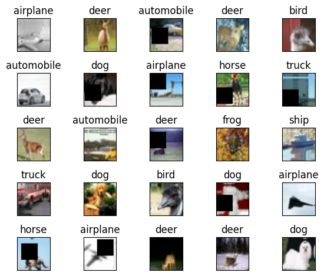
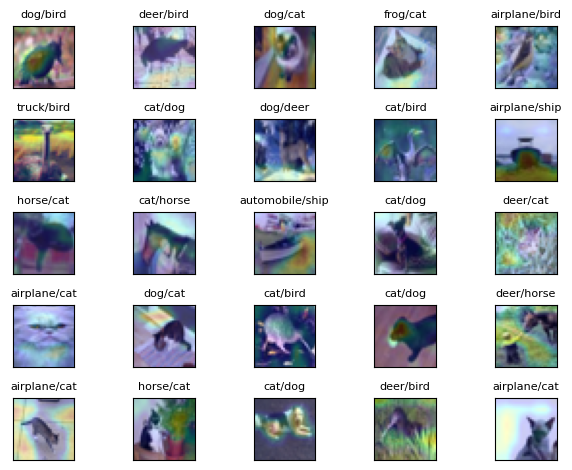

# ERA V1 Session 11 - Grad CAM Visualizations

## Contents
* [Introduction](#Introduction)
* [Code Links](#Code-Links)
* [Model](#Model)
* [Grad CAM Visualization](#Optimizer-and-Scheduler)

# Introduction
In this module, we train a [Resnet18](https://pytorch.org/hub/pytorch_vision_resnet/) model to perform image classification on CIFAR-10 dataset. We will also generate Grad-Cam saliency maps on some of the misclassified images to try and understand what features caused the wrong model prediction. The following image augmentations were applied to the dataset:
* Random Crop and Pad with a padding of 4 and image size 32 x 32
* Cutout with a patch size of 16

The images below show some samples along with their labels. 



# Code Links
* The main repo can be found [here](https://github.com/jyanivaddi/dl_hub/tree/main). This repository contains all the model related stuff, helper methods, and visualization utilities. 
* The Resnet model used in the notebook is cloned from the following repository: [Resnet Model](https://github.com/kuangliu/pytorch-cifar)
* The GradCAM visualization is generated using the following repository: [GradCAM](https://github.com/jacobgil/pytorch-grad-cam)

# Model
The model used in this notebook is RESNET 18. Here is a summary of the model we used to perform classification. The table below is generated using the python package [torchinfo](https://pypi.org/project/torchinfo/) This provides a more intuitive and detailed model summary than the torchsummary package. 

```
=====================================================================================================================================================================
Layer (type:depth-idx)                   Kernel Shape              Input Shape               Output Shape              Param #                   Mult-Adds
=====================================================================================================================================================================
ResNet                                   --                        [1, 3, 32, 32]            [1, 10]                   --                        --
├─Conv2d: 1-1                            [3, 3]                    [1, 3, 32, 32]            [1, 64, 32, 32]           1,728                     1,769,472
├─BatchNorm2d: 1-2                       --                        [1, 64, 32, 32]           [1, 64, 32, 32]           128                       128
├─Sequential: 1-3                        --                        [1, 64, 32, 32]           [1, 64, 32, 32]           --                        --
│    └─BasicBlock: 2-1                   --                        [1, 64, 32, 32]           [1, 64, 32, 32]           --                        --
│    │    └─Conv2d: 3-1                  [3, 3]                    [1, 64, 32, 32]           [1, 64, 32, 32]           36,864                    37,748,736
│    │    └─BatchNorm2d: 3-2             --                        [1, 64, 32, 32]           [1, 64, 32, 32]           128                       128
│    │    └─Conv2d: 3-3                  [3, 3]                    [1, 64, 32, 32]           [1, 64, 32, 32]           36,864                    37,748,736
│    │    └─BatchNorm2d: 3-4             --                        [1, 64, 32, 32]           [1, 64, 32, 32]           128                       128
│    │    └─Sequential: 3-5              --                        [1, 64, 32, 32]           [1, 64, 32, 32]           --                        --
│    └─BasicBlock: 2-2                   --                        [1, 64, 32, 32]           [1, 64, 32, 32]           --                        --
│    │    └─Conv2d: 3-6                  [3, 3]                    [1, 64, 32, 32]           [1, 64, 32, 32]           36,864                    37,748,736
│    │    └─BatchNorm2d: 3-7             --                        [1, 64, 32, 32]           [1, 64, 32, 32]           128                       128
│    │    └─Conv2d: 3-8                  [3, 3]                    [1, 64, 32, 32]           [1, 64, 32, 32]           36,864                    37,748,736
│    │    └─BatchNorm2d: 3-9             --                        [1, 64, 32, 32]           [1, 64, 32, 32]           128                       128
│    │    └─Sequential: 3-10             --                        [1, 64, 32, 32]           [1, 64, 32, 32]           --                        --
├─Sequential: 1-4                        --                        [1, 64, 32, 32]           [1, 128, 16, 16]          --                        --
│    └─BasicBlock: 2-3                   --                        [1, 64, 32, 32]           [1, 128, 16, 16]          --                        --
│    │    └─Conv2d: 3-11                 [3, 3]                    [1, 64, 32, 32]           [1, 128, 16, 16]          73,728                    18,874,368
│    │    └─BatchNorm2d: 3-12            --                        [1, 128, 16, 16]          [1, 128, 16, 16]          256                       256
│    │    └─Conv2d: 3-13                 [3, 3]                    [1, 128, 16, 16]          [1, 128, 16, 16]          147,456                   37,748,736
│    │    └─BatchNorm2d: 3-14            --                        [1, 128, 16, 16]          [1, 128, 16, 16]          256                       256
│    │    └─Sequential: 3-15             --                        [1, 64, 32, 32]           [1, 128, 16, 16]          8,448                     2,097,408
│    └─BasicBlock: 2-4                   --                        [1, 128, 16, 16]          [1, 128, 16, 16]          --                        --
│    │    └─Conv2d: 3-16                 [3, 3]                    [1, 128, 16, 16]          [1, 128, 16, 16]          147,456                   37,748,736
│    │    └─BatchNorm2d: 3-17            --                        [1, 128, 16, 16]          [1, 128, 16, 16]          256                       256
│    │    └─Conv2d: 3-18                 [3, 3]                    [1, 128, 16, 16]          [1, 128, 16, 16]          147,456                   37,748,736
│    │    └─BatchNorm2d: 3-19            --                        [1, 128, 16, 16]          [1, 128, 16, 16]          256                       256
│    │    └─Sequential: 3-20             --                        [1, 128, 16, 16]          [1, 128, 16, 16]          --                        --
├─Sequential: 1-5                        --                        [1, 128, 16, 16]          [1, 256, 8, 8]            --                        --
│    └─BasicBlock: 2-5                   --                        [1, 128, 16, 16]          [1, 256, 8, 8]            --                        --
│    │    └─Conv2d: 3-21                 [3, 3]                    [1, 128, 16, 16]          [1, 256, 8, 8]            294,912                   18,874,368
│    │    └─BatchNorm2d: 3-22            --                        [1, 256, 8, 8]            [1, 256, 8, 8]            512                       512
│    │    └─Conv2d: 3-23                 [3, 3]                    [1, 256, 8, 8]            [1, 256, 8, 8]            589,824                   37,748,736
│    │    └─BatchNorm2d: 3-24            --                        [1, 256, 8, 8]            [1, 256, 8, 8]            512                       512
│    │    └─Sequential: 3-25             --                        [1, 128, 16, 16]          [1, 256, 8, 8]            33,280                    2,097,664
│    └─BasicBlock: 2-6                   --                        [1, 256, 8, 8]            [1, 256, 8, 8]            --                        --
│    │    └─Conv2d: 3-26                 [3, 3]                    [1, 256, 8, 8]            [1, 256, 8, 8]            589,824                   37,748,736
│    │    └─BatchNorm2d: 3-27            --                        [1, 256, 8, 8]            [1, 256, 8, 8]            512                       512
│    │    └─Conv2d: 3-28                 [3, 3]                    [1, 256, 8, 8]            [1, 256, 8, 8]            589,824                   37,748,736
│    │    └─BatchNorm2d: 3-29            --                        [1, 256, 8, 8]            [1, 256, 8, 8]            512                       512
│    │    └─Sequential: 3-30             --                        [1, 256, 8, 8]            [1, 256, 8, 8]            --                        --
├─Sequential: 1-6                        --                        [1, 256, 8, 8]            [1, 512, 4, 4]            --                        --
│    └─BasicBlock: 2-7                   --                        [1, 256, 8, 8]            [1, 512, 4, 4]            --                        --
│    │    └─Conv2d: 3-31                 [3, 3]                    [1, 256, 8, 8]            [1, 512, 4, 4]            1,179,648                 18,874,368
│    │    └─BatchNorm2d: 3-32            --                        [1, 512, 4, 4]            [1, 512, 4, 4]            1,024                     1,024
│    │    └─Conv2d: 3-33                 [3, 3]                    [1, 512, 4, 4]            [1, 512, 4, 4]            2,359,296                 37,748,736
│    │    └─BatchNorm2d: 3-34            --                        [1, 512, 4, 4]            [1, 512, 4, 4]            1,024                     1,024
│    │    └─Sequential: 3-35             --                        [1, 256, 8, 8]            [1, 512, 4, 4]            132,096                   2,098,176
│    └─BasicBlock: 2-8                   --                        [1, 512, 4, 4]            [1, 512, 4, 4]            --                        --
│    │    └─Conv2d: 3-36                 [3, 3]                    [1, 512, 4, 4]            [1, 512, 4, 4]            2,359,296                 37,748,736
│    │    └─BatchNorm2d: 3-37            --                        [1, 512, 4, 4]            [1, 512, 4, 4]            1,024                     1,024
│    │    └─Conv2d: 3-38                 [3, 3]                    [1, 512, 4, 4]            [1, 512, 4, 4]            2,359,296                 37,748,736
│    │    └─BatchNorm2d: 3-39            --                        [1, 512, 4, 4]            [1, 512, 4, 4]            1,024                     1,024
│    │    └─Sequential: 3-40             --                        [1, 512, 4, 4]            [1, 512, 4, 4]            --                        --
├─Linear: 1-7                            --                        [1, 512]                  [1, 10]                   5,130                     5,130
=====================================================================================================================================================================
Total params: 11,173,962
Trainable params: 11,173,962
Non-trainable params: 0
Total mult-adds (M): 555.43
=====================================================================================================================================================================
Input size (MB): 0.01
Forward/backward pass size (MB): 9.83
Params size (MB): 44.70
Estimated Total Size (MB): 54.54
=====================================================================================================================================================================
```

# Optimizer and Scheduler
For this model, we use [SGD optimizer](https://pytorch.org/docs/stable/generated/torch.optim.SGD.html) for implementing back propagation. We use [Cross Entropy Loss](https://pytorch.org/docs/stable/generated/torch.nn.CrossEntropyLoss.html) to compute the loss. 

In order the schedule the learning rate, and to achieve faster convergence, we use [ReduceLROnPlateau](https://pytorch.org/docs/stable/generated/torch.optim.lr_scheduler.ReduceLROnPlateau.html) scheduler. This scheduler reduces the learning rate by a factor of 10 if the validation loss does not reduce by 0.1 in 4 epochs.  
For this model, the ReduceLROnPleateau is defined as follows:
```
scheduler = ReduceLROnPlateau(
            optimizer, 
            mode='min', 
            factor=10, 
            patience=4, 
            threshold=0.1,
            verbose=True)
```
Figure below shows how the learning rate varied from a starting value of 0.01 over 20 epochs of training. 


# Results

**The model was run for 20 epochs and has achieved a maximum validation accuracy of 89.93**. The table below shows the training log over 24 epochs. This table is generated using a python package [PrettyTable](https://pypi.org/project/prettytable/)
```
+-------+---------------------+-----------------------+----------------+--------------+
| Epoch |      Train loss     |        Val loss       | Train Accuracy | Val Accuracy |
+-------+---------------------+-----------------------+----------------+--------------+
|   1   |  1.6696627602285268 |  0.002676322400569916 |     38.03      |    50.58     |
|   2   |  1.2541125599218874 |  0.002293989551067352 |     54.37      |    59.28     |
|   3   |  1.058799063064614  | 0.0022097944676876067 |     61.724     |     62.6     |
|   4   |  0.9177842809229481 | 0.0017800646483898163 |     67.078     |    69.13     |
|   5   |  0.8166992451463427 | 0.0019941176414489748 |     71.114     |    68.04     |
|   6   |  0.7420563071357961 | 0.0017103487253189087 |     73.784     |    71.85     |
|   7   |  0.6818826484436892 | 0.0012291806519031524 |     75.94      |    78.76     |
|   8   |  0.6322351164963781 | 0.0011138746738433838 |     77.844     |    80.87     |
|   9   |  0.5942750557952997 |  0.001181876716017723 |     79.012     |    80.12     |
|   10  |  0.5572338609062896 | 0.0010618222504854202 |     80.35      |    82.49     |
|   11  |  0.5256265827587673 | 0.0014884945034980774 |     81.48      |    76.98     |
|   12  |  0.4947068119535641 | 0.0011649684578180313 |     82.752     |    81.19     |
|   13  |  0.4656812046863595 |  0.001031007593870163 |     83.614     |    82.73     |
|   14  |  0.4506419243253007 | 0.0012266556859016418 |     84.214     |    80.36     |
|   15  | 0.43375201796998786 | 0.0009742417216300964 |     84.702     |    84.35     |
|   16  | 0.34686458414914656 | 0.0006753532230854034 |     87.884     |     89.1     |
|   17  | 0.31310801086377127 | 0.0006671007007360458 |      89.2      |    89.18     |
|   18  |  0.3064430118823538 |  0.000658100937306881 |     89.278     |    89.41     |
|   19  |  0.2989808930730333 | 0.0006687365680932999 |     89.624     |    89.15     |
|   20  |  0.2899815012909928 | 0.0006697051078081131 |     89.934     |    89.25     |
+-------+---------------------+-----------------------+----------------+--------------+
```
The plots below show the train and test loss over 20 epochs of training. 


The plots below show the train and test accuracy over 20 epochs of training. 


# Grad CAM 
Gradient weighted Class Activatin Mapping ([GradCAM](https://arxiv.org/pdf/1611.07450.pdf)) is an explaianability utility that highlights the regions in the image that cause the model to make a certain prediction. The images below shows some of the misclassified images. In the title, the first label is the predicted, and the second label is the ground truth.


The images below shows the grad cam saliency map for these misclassified images.


