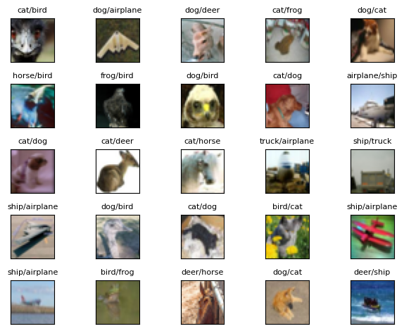

# ERA V1 Session 12 - Pytorch Lightning 

# Introduction
In this module, we explore pytorch lightning for building end to end deep learning applications. [Lightning](https://www.pytorchlightning.ai/index.html) is a wrapper built on top of pytorch to improve the speed and convenience of building deep learning applications. Lightning eliminates most of the boiler plate code that needs to be otherwise included in pytorch and help us focus on developing great applications! 

In this notebook, we retrain the custom resnet model that we wrote in [Session 10](https://github.com/jyanivaddi/ERA_V1/tree/master/session_10) using torch lightning. Using lightning, we achieved a validation accuracy of **93%** on the CIFAR10 dataset.   

# Code Links
* The main repo can be found [here](https://github.com/jyanivaddi/dl_hub/tree/main).
  * The custom resnet model that we built in session 10 can be found [here](https://github.com/jyanivaddi/dl_hub/blob/main/models/custom_resnet.py) and the corresponding Lightning model can be found [here](https://github.com/jyanivaddi/dl_hub/blob/main/models/pl_custom_resnet.py)
  * The Datamodule for pytorch lightning defition is defined [here](https://github.com/jyanivaddi/dl_hub/blob/main/dataloaders/pl_custom_cifar10_datamodule.py). Using this datamodule, we read the train, test, and validation datasets on CIFAR10 using the image augmentations defined with [albumentations](https://albumentations.ai/) library. 
  * The main code that instantiates the model, runs the training, inference, and test is defined [here](https://github.com/jyanivaddi/dl_hub/blob/main/PL_main.py) 
  * Several helper functions to compute misclassified images,GradCAM images, etc is defined in the [utils](https://github.com/jyanivaddi/dl_hub/tree/main/utils) module.


# Model
The model used in this notebook same as the one we used in session 10 and was explained [here](https://github.com/jyanivaddi/ERA_V1/tree/master/session_10#Model) In this notebook, we use the same model but write a pytorch lightning wrapper that contains the following methods:

# Optimizer
The details of the optimizer and scheduler can be found from the session 10 note book [here](https://github.com/jyanivaddi/ERA_V1/blob/master/session_10/README.md#Optimizer-and-Scheduler)

# Results
The model achieved a **93%** validation accuracy on the CIFAR10 dataset in 24 epochs. 

Here is the log summary from training the model for 24 epochs. 

```
+-------+--------------------+--------------------+-------------------+--------------------+
| Epoch |     Train loss     |      Val loss      |   Train Accuracy  |    Val Accuracy    |
+-------+--------------------+--------------------+-------------------+--------------------+
|   1   | 1.1435045003890991 | 1.0840182304382324 |  60.9649121761322 | 60.839998722076416 |
|   2   | 1.036236047744751  | 0.9558890461921692 | 64.47368264198303 | 66.72000288963318  |
|   3   | 0.8587070107460022 | 1.0186161994934082 | 69.07894611358643 |  67.5000011920929  |
|   4   | 0.736008882522583  | 1.1661306619644165 | 74.56140518188477 | 64.52000141143799  |
|   5   | 0.7063784003257751 | 0.6499078273773193 | 73.02631735801697 |  77.6199996471405  |
|   6   | 0.5319482088088989 | 0.5696163177490234 | 80.04385828971863 |  80.0000011920929  |
|   7   | 0.6123452186584473 | 0.6350142359733582 | 78.28947305679321 | 78.51999998092651  |
|   8   | 0.5396375060081482 | 0.6488333940505981 | 81.57894611358643 | 77.60000228881836  |
|   9   | 0.4547218084335327 | 0.5042816996574402 | 82.01754093170166 | 82.48000144958496  |
|   10  | 0.5154619216918945 | 0.537339448928833  | 81.35964870452881 | 81.84000253677368  |
|   11  | 0.3968458771705627 |  0.4348164498806   | 85.74561476707458 | 85.32000184059143  |
|   12  | 0.4324221611022949 | 0.5237318873405457 | 85.30701994895935 | 82.85999894142151  |
|   13  | 0.4530175626277923 | 0.4001402258872986 | 85.30701994895935 | 85.69999933242798  |
|   14  | 0.2700484991073608 | 0.4288248419761657 | 90.35087823867798 | 85.68000197410583  |
|   15  | 0.3214578330516815 | 0.4134277701377868 | 87.71929740905762 | 85.69999933242798  |
|   16  | 0.3845024704933166 | 0.4404365718364715 | 87.06140518188477 | 84.78000164031982  |
|   17  | 0.3409077823162079 | 0.3586389720439911 | 88.81579041481018 |  87.6200020313263  |
|   18  | 0.235961765050888  | 0.344649076461792  | 91.66666865348816 | 88.41999769210815  |
|   19  | 0.2175706326961517 | 0.3371973037719726 |  92.324560880661  | 89.53999876976013  |
|   20  |  0.21663299202919  | 0.2798574566841125 | 91.66666865348816 |  90.3599977493286  |
|   21  | 0.2113790959119796 | 0.2496803700923919 |  93.6403512954712 | 91.79999828338624  |
|   22  | 0.1594023406505584 | 0.2260725051164627 | 94.29824352264404 | 92.82000064849854  |
|   23  | 0.1674529165029525 | 0.2078412622213363 |  93.8596487045288 | 93.14000010490416  |
+-------+--------------------+--------------------+-------------------+--------------------+
```


The plots below show the validation and train losses over the training duration

The plot below shows the learning rate variation along the 24 epochs. The learning rate varied from an initial value of 7.8E-6 at step 1 to a max LR of 0.0157 at the end of the 5th epoch, after which it was again linearly reduced to the initial value by the end of the 24th epoch.


The plots below show the train accuracy, validation accuracy, train loss, and the validation loss at each step.  


The image gallery below shows some examples of the misclassified images on the cifar-10 test dataset, along with their corresponding grad cam maps in the next image.




