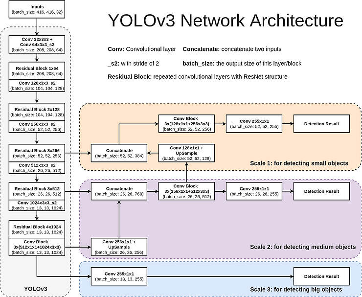
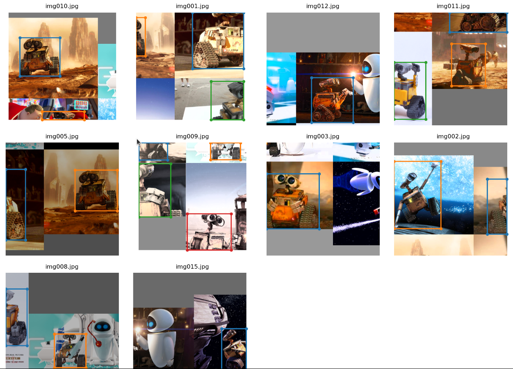
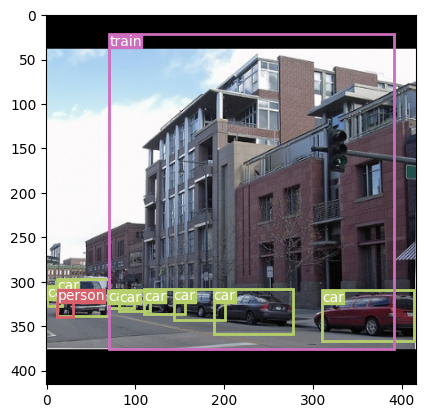
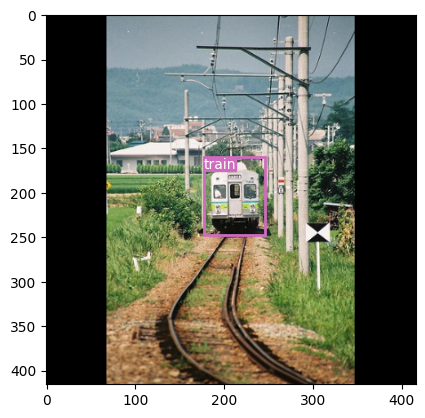
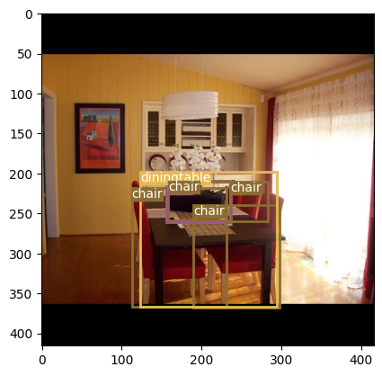

# ERA V1 Session 13 - Training YOLOv3 Object Detection model from scratch

We train an object detection model from scratch using the YOLOv3 algorithm. The original paper on YOLOv3 can be found [here](https://arxiv.org/abs/1804.02767). After training for 40 epochs, the model has achieved the following metrics:


| Metric    | Value |
| :-------- | -------: |
| Test class accuracy  | 88.84 %    |
| Test No Object Accuracy | 98.91 %     |
| Test Object Accuracy    | 72.71 %    |
| Mean Average Precision (MAP)     | 46 % |


## Code Links
* The entire source code for YOLO model can be found [here](https://github.com/jyanivaddi/dl_hub/tree/main/YOLO_V3). This is provided as part of the class notes in session 13 of the ERA V1 course (Thanks Rohan! :smile: )
* The EigenCAM explainability maps were generated using the [pytorch-gradcam](https://github.com/jacobgil/pytorch-grad-cam) library.  
* The PASCAL VOC dataset used to train the model is from [Kaggle](https://www.kaggle.com/datasets/aladdinpersson/pascal-voc-dataset-used-in-yolov3-video?resource=download).
* The model is hosted as HuggingFace spaces and is available [here](https://huggingface.co/spaces/jvaddi/ObjectDetectionYOLOv3).


## Model
This notebook is trained on the YOLOv3 model. Here is the architecture of the model. 



The model summary is as follows:

```
====================================================================================================================================================================================
Layer (type:depth-idx)                                  Kernel Shape              Input Shape               Output Shape              Param #                   Mult-Adds
====================================================================================================================================================================================
LitYOLOv3                                               --                        [1, 3, 416, 416]          [1, 3, 13, 13, 25]        --                        --
├─YOLOv3: 1-1                                           --                        --                        --                        --                        --
│    └─ModuleList: 2-1                                  --                        --                        --                        --                        --
│    │    └─CNNBlock: 3-1                               --                        [1, 3, 416, 416]          [1, 32, 416, 416]         928                       149,520,448
│    │    └─CNNBlock: 3-2                               --                        [1, 32, 416, 416]         [1, 64, 208, 208]         18,560                    797,442,176
│    │    └─ResidualBlock: 3-3                          --                        [1, 64, 208, 208]         [1, 64, 208, 208]         20,672                    886,046,912
│    │    └─CNNBlock: 3-4                               --                        [1, 64, 208, 208]         [1, 128, 104, 104]        73,984                    797,442,304
│    │    └─ResidualBlock: 3-5                          --                        [1, 128, 104, 104]        [1, 128, 104, 104]        164,608                   1,772,094,208
│    │    └─CNNBlock: 3-6                               --                        [1, 128, 104, 104]        [1, 256, 52, 52]          295,424                   797,442,560
│    │    └─ResidualBlock: 3-7                          --                        [1, 256, 52, 52]          [1, 256, 52, 52]          2,627,584                 7,088,379,904
│    │    └─CNNBlock: 3-8                               --                        [1, 256, 52, 52]          [1, 512, 26, 26]          1,180,672                 797,443,072
│    │    └─ResidualBlock: 3-9                          --                        [1, 512, 26, 26]          [1, 512, 26, 26]          10,498,048                7,088,386,048
│    │    └─CNNBlock: 3-10                              --                        [1, 512, 26, 26]          [1, 1024, 13, 13]         4,720,640                 797,444,096
│    │    └─ResidualBlock: 3-11                         --                        [1, 1024, 13, 13]         [1, 1024, 13, 13]         20,983,808                3,544,199,168
│    │    └─CNNBlock: 3-12                              --                        [1, 1024, 13, 13]         [1, 512, 13, 13]          525,312                   88,605,696
│    │    └─CNNBlock: 3-13                              --                        [1, 512, 13, 13]          [1, 1024, 13, 13]         4,720,640                 797,444,096
│    │    └─ResidualBlock: 3-14                         --                        [1, 1024, 13, 13]         [1, 1024, 13, 13]         5,245,952                 886,049,792
│    │    └─CNNBlock: 3-15                              --                        [1, 1024, 13, 13]         [1, 512, 13, 13]          525,312                   88,605,696
│    │    └─ScalePrediction: 3-16                       --                        [1, 512, 13, 13]          [1, 3, 13, 13, 25]        4,797,665                 810,435,971
│    │    └─CNNBlock: 3-17                              --                        [1, 512, 13, 13]          [1, 256, 13, 13]          131,584                   22,151,680
│    │    └─Upsample: 3-18                              --                        [1, 256, 13, 13]          [1, 256, 26, 26]          --                        --
│    │    └─CNNBlock: 3-19                              --                        [1, 768, 26, 26]          [1, 256, 26, 26]          197,120                   132,907,520
│    │    └─CNNBlock: 3-20                              --                        [1, 256, 26, 26]          [1, 512, 26, 26]          1,180,672                 797,443,072
│    │    └─ResidualBlock: 3-21                         --                        [1, 512, 26, 26]          [1, 512, 26, 26]          1,312,256                 886,048,256
│    │    └─CNNBlock: 3-22                              --                        [1, 512, 26, 26]          [1, 256, 26, 26]          131,584                   88,605,184
│    │    └─ScalePrediction: 3-23                       --                        [1, 256, 26, 26]          [1, 3, 26, 26, 25]        1,219,297                 823,452,172
│    │    └─CNNBlock: 3-24                              --                        [1, 256, 26, 26]          [1, 128, 26, 26]          33,024                    22,151,424
│    │    └─Upsample: 3-25                              --                        [1, 128, 26, 26]          [1, 128, 52, 52]          --                        --
│    │    └─CNNBlock: 3-26                              --                        [1, 384, 52, 52]          [1, 128, 52, 52]          49,408                    132,907,264
│    │    └─CNNBlock: 3-27                              --                        [1, 128, 52, 52]          [1, 256, 52, 52]          295,424                   797,442,560
│    │    └─ResidualBlock: 3-28                         --                        [1, 256, 52, 52]          [1, 256, 52, 52]          328,448                   886,047,488
│    │    └─CNNBlock: 3-29                              --                        [1, 256, 52, 52]          [1, 128, 52, 52]          33,024                    88,604,928
│    │    └─ScalePrediction: 3-30                       --                        [1, 128, 52, 52]          [1, 3, 52, 52, 25]        314,849                   849,562,160
====================================================================================================================================================================================
Total params: 61,626,499
Trainable params: 61,626,499
Non-trainable params: 0
Total mult-adds (G): 32.71
====================================================================================================================================================================================
Input size (MB): 2.08
Forward/backward pass size (MB): 614.75
Params size (MB): 246.50
Estimated Total Size (MB): 863.33
====================================================================================================================================================================================
```

## Mosaic Augmentation
In order to improve the accuracy, we implement the [mosaic augmentation](https://iopscience.iop.org/article/10.1088/1742-6596/1684/1/012094/pdf) technique here. In this method, 4 randomly selected images from the train set are combined into a single image, each image forming a quarter of the final image. some examples of mosaic augmentation are shown in the image below:



## Optimizer and Scheduler
We use OneCycleLR scheduler with the following parameters to train the model:

```
scheduler = OneCycleLR(
    optimizer,
    max_lr=8E-04,
    steps_per_epoch=len(train_data_loader),
    epochs=40,
    pct_start=0.125,
    div_factor=100,
    three_phase=False,
    final_div_factor=100,
    anneal_strategy='linear'
)
```


## Implementation
The model is implemented on Pytorch Lightning and trained for 40 epochs on the PASCAL VOC dataset. The implemetation includes the following:
 * A pytorch lightning [Model](https://github.com/jyanivaddi/dl_hub/blob/main/YOLO_V3/PL_model.py) written as a wrapper to the original model written using [Pytorch](https://github.com/jyanivaddi/dl_hub/blob/main/YOLO_V3/model.py).
 * A lightning [datamodule](https://github.com/jyanivaddi/dl_hub/blob/main/YOLO_V3/yolo_v3_utils/PL_data_module.py) written as a wrapper to the Yolov3 [data loader](https://github.com/jyanivaddi/dl_hub/blob/main/YOLO_V3/yolo_v3_utils/pascal_voc_dataset_mosaic.py).    
 

## Results
Here is the log summary from training the model for 40 epochs. 

```
Using 16bit None Automatic Mixed Precision (AMP)
GPU available: True (cuda), used: True
TPU available: False, using: 0 TPU cores
IPU available: False, using: 0 IPUs
HPU available: False, using: 0 HPUs
LOCAL_RANK: 0 - CUDA_VISIBLE_DEVICES: [0]

  | Name           | Type     | Params
--------------------------------------------
0 | model          | YOLOv3   | 61.6 M
1 | loss_criterion | YoloLoss | 0     
--------------------------------------------
61.6 M    Trainable params
0         Non-trainable params
61.6 M    Total params
123.253   Total estimated model params size (MB)
Training: 0it [00:00, ?it/s]
Validation: 0it [00:00, ?it/s]
epoch: 0  val_Class_Accuracy: 45.45454788208008
epoch: 0  val_No_Obj_Accuracy: 90.34444427490234
epoch: 0  val_Obj_Accuracy: 18.18181800842285
Validation: 0it [00:00, ?it/s]
epoch: 1  val_Class_Accuracy: 45.45454788208008
epoch: 1  val_No_Obj_Accuracy: 99.39728546142578
epoch: 1  val_Obj_Accuracy: 0.0
Validation: 0it [00:00, ?it/s]
epoch: 2  val_Class_Accuracy: 39.39393997192383
epoch: 2  val_No_Obj_Accuracy: 99.73690032958984
epoch: 2  val_Obj_Accuracy: 6.060606002807617
Validation: 0it [00:00, ?it/s]
epoch: 3  val_Class_Accuracy: 42.42424392700195
epoch: 3  val_No_Obj_Accuracy: 98.84288787841797
epoch: 3  val_Obj_Accuracy: 30.30303192138672
Validation: 0it [00:00, ?it/s]
epoch: 4  val_Class_Accuracy: 57.57575607299805
epoch: 4  val_No_Obj_Accuracy: 98.03345489501953
epoch: 4  val_Obj_Accuracy: 33.333335876464844
Validation: 0it [00:00, ?it/s]
epoch: 5  val_Class_Accuracy: 21.212121963500977
epoch: 5  val_No_Obj_Accuracy: 98.38380432128906
epoch: 5  val_Obj_Accuracy: 30.30303192138672
Validation: 0it [00:00, ?it/s]
epoch: 6  val_Class_Accuracy: 51.51515197753906
epoch: 6  val_No_Obj_Accuracy: 98.46031951904297
epoch: 6  val_Obj_Accuracy: 30.30303192138672
Validation: 0it [00:00, ?it/s]
epoch: 7  val_Class_Accuracy: 63.6363639831543
epoch: 7  val_No_Obj_Accuracy: 98.67912292480469
epoch: 7  val_Obj_Accuracy: 18.18181800842285
Validation: 0it [00:00, ?it/s]
epoch: 8  val_Class_Accuracy: 48.48484802246094
epoch: 8  val_No_Obj_Accuracy: 97.29381561279297
epoch: 8  val_Obj_Accuracy: 33.333335876464844
Validation: 0it [00:00, ?it/s]
epoch: 9  val_Class_Accuracy: 21.212121963500977
epoch: 9  val_No_Obj_Accuracy: 98.5059585571289
epoch: 9  val_Obj_Accuracy: 36.3636360168457
Validation: 0it [00:00, ?it/s]
epoch: 10  val_Class_Accuracy: 51.51515197753906
epoch: 10  val_No_Obj_Accuracy: 98.72207641601562
epoch: 10  val_Obj_Accuracy: 33.333335876464844
Validation: 0it [00:00, ?it/s]
epoch: 11  val_Class_Accuracy: 51.51515197753906
epoch: 11  val_No_Obj_Accuracy: 98.3623275756836
epoch: 11  val_Obj_Accuracy: 33.333335876464844
Validation: 0it [00:00, ?it/s]
epoch: 12  val_Class_Accuracy: 57.57575607299805
epoch: 12  val_No_Obj_Accuracy: 98.66972351074219
epoch: 12  val_Obj_Accuracy: 30.30303192138672
Validation: 0it [00:00, ?it/s]
epoch: 13  val_Class_Accuracy: 60.60606384277344
epoch: 13  val_No_Obj_Accuracy: 99.31271362304688
epoch: 13  val_Obj_Accuracy: 33.333335876464844
Validation: 0it [00:00, ?it/s]
epoch: 14  val_Class_Accuracy: 72.7272720336914
epoch: 14  val_No_Obj_Accuracy: 98.94759368896484
epoch: 14  val_Obj_Accuracy: 42.42424392700195
Validation: 0it [00:00, ?it/s]
epoch: 15  val_Class_Accuracy: 72.7272720336914
epoch: 15  val_No_Obj_Accuracy: 98.56636810302734
epoch: 15  val_Obj_Accuracy: 48.48484802246094
Validation: 0it [00:00, ?it/s]
epoch: 16  val_Class_Accuracy: 72.7272720336914
epoch: 16  val_No_Obj_Accuracy: 98.42407989501953
epoch: 16  val_Obj_Accuracy: 36.3636360168457
Validation: 0it [00:00, ?it/s]
epoch: 17  val_Class_Accuracy: 72.7272720336914
epoch: 17  val_No_Obj_Accuracy: 98.99726104736328
epoch: 17  val_Obj_Accuracy: 33.333335876464844
Validation: 0it [00:00, ?it/s]
epoch: 18  val_Class_Accuracy: 51.51515197753906
epoch: 18  val_No_Obj_Accuracy: 98.77308654785156
epoch: 18  val_Obj_Accuracy: 42.42424392700195
Validation: 0it [00:00, ?it/s]
epoch: 19  val_Class_Accuracy: 69.69696807861328
epoch: 19  val_No_Obj_Accuracy: 98.91671752929688
epoch: 19  val_Obj_Accuracy: 42.42424392700195
Validation: 0it [00:00, ?it/s]
epoch: 20  val_Class_Accuracy: 84.8484878540039
epoch: 20  val_No_Obj_Accuracy: 98.73147583007812
epoch: 20  val_Obj_Accuracy: 42.42424392700195
Validation: 0it [00:00, ?it/s]
epoch: 21  val_Class_Accuracy: 51.51515197753906
epoch: 21  val_No_Obj_Accuracy: 98.8992691040039
epoch: 21  val_Obj_Accuracy: 42.42424392700195
Validation: 0it [00:00, ?it/s]
epoch: 22  val_Class_Accuracy: 90.90909576416016
epoch: 22  val_No_Obj_Accuracy: 98.88316345214844
epoch: 22  val_Obj_Accuracy: 36.3636360168457
Validation: 0it [00:00, ?it/s]
epoch: 23  val_Class_Accuracy: 90.90909576416016
epoch: 23  val_No_Obj_Accuracy: 99.03484344482422
epoch: 23  val_Obj_Accuracy: 42.42424392700195
Validation: 0it [00:00, ?it/s]
epoch: 24  val_Class_Accuracy: 81.81818389892578
epoch: 24  val_No_Obj_Accuracy: 98.68852233886719
epoch: 24  val_Obj_Accuracy: 57.57575607299805
Validation: 0it [00:00, ?it/s]
epoch: 25  val_Class_Accuracy: 100.0
epoch: 25  val_No_Obj_Accuracy: 98.9032974243164
epoch: 25  val_Obj_Accuracy: 45.45454788208008
Validation: 0it [00:00, ?it/s]
epoch: 26  val_Class_Accuracy: 90.90909576416016
epoch: 26  val_No_Obj_Accuracy: 98.96772766113281
epoch: 26  val_Obj_Accuracy: 48.48484802246094
Validation: 0it [00:00, ?it/s]
epoch: 27  val_Class_Accuracy: 78.78787994384766
epoch: 27  val_No_Obj_Accuracy: 98.76637268066406
epoch: 27  val_Obj_Accuracy: 57.57575607299805
Validation: 0it [00:00, ?it/s]
epoch: 28  val_Class_Accuracy: 84.8484878540039
epoch: 28  val_No_Obj_Accuracy: 99.06706237792969
epoch: 28  val_Obj_Accuracy: 45.45454788208008
Validation: 0it [00:00, ?it/s]
epoch: 29  val_Class_Accuracy: 93.93939208984375
epoch: 29  val_No_Obj_Accuracy: 98.91940307617188
epoch: 29  val_Obj_Accuracy: 45.45454788208008
Validation: 0it [00:00, ?it/s]
epoch: 30  val_Class_Accuracy: 100.0
epoch: 30  val_No_Obj_Accuracy: 99.11405181884766
epoch: 30  val_Obj_Accuracy: 57.57575607299805
Validation: 0it [00:00, ?it/s]
epoch: 31  val_Class_Accuracy: 96.96969604492188
epoch: 31  val_No_Obj_Accuracy: 99.06706237792969
epoch: 31  val_Obj_Accuracy: 48.48484802246094
Validation: 0it [00:00, ?it/s]
epoch: 32  val_Class_Accuracy: 100.0
epoch: 32  val_No_Obj_Accuracy: 98.93953704833984
epoch: 32  val_Obj_Accuracy: 60.60606384277344
Validation: 0it [00:00, ?it/s]
epoch: 33  val_Class_Accuracy: 100.0
epoch: 33  val_No_Obj_Accuracy: 98.99054718017578
epoch: 33  val_Obj_Accuracy: 57.57575607299805
Validation: 0it [00:00, ?it/s]
epoch: 34  val_Class_Accuracy: 96.96969604492188
epoch: 34  val_No_Obj_Accuracy: 99.15565490722656
epoch: 34  val_Obj_Accuracy: 60.60606384277344
Validation: 0it [00:00, ?it/s]
epoch: 35  val_Class_Accuracy: 96.96969604492188
epoch: 35  val_No_Obj_Accuracy: 99.13418579101562
epoch: 35  val_Obj_Accuracy: 60.60606384277344
Validation: 0it [00:00, ?it/s]
epoch: 36  val_Class_Accuracy: 100.0
epoch: 36  val_No_Obj_Accuracy: 99.04155731201172
epoch: 36  val_Obj_Accuracy: 69.69696807861328
Validation: 0it [00:00, ?it/s]
epoch: 37  val_Class_Accuracy: 96.96969604492188
epoch: 37  val_No_Obj_Accuracy: 99.12881469726562
epoch: 37  val_Obj_Accuracy: 54.54545593261719
Validation: 0it [00:00, ?it/s]
epoch: 38  val_Class_Accuracy: 100.0
epoch: 38  val_No_Obj_Accuracy: 99.12747192382812
epoch: 38  val_Obj_Accuracy: 60.60606384277344
Validation: 0it [00:00, ?it/s]
epoch: 39  val_Class_Accuracy: 100.0
epoch: 39  val_No_Obj_Accuracy: 99.1476058959961
epoch: 39  val_Obj_Accuracy: 60.60606384277344
`Trainer.fit` stopped: `max_epochs=40` reached.
LOCAL_RANK: 0 - CUDA_VISIBLE_DEVICES: [0]
Testing: 0it [00:00, ?it/s]
────────────────────────────────────────────────────────────────────────────────────────────────────────────────────────
       Test metric             DataLoader 0
────────────────────────────────────────────────────────────────────────────────────────────────────────────────────────
   test_Class_Accuracy       88.84369659423828
  test_No_Obj_Accuracy       98.90843963623047
    test_Obj_Accuracy        72.7097396850586
────────────────────────────────────────────────────────────────────────────────────────────────────────────────────────
```

## Sample Detections
Below are a few sample detections from the PASCAL-VOC dataset






## EigenCAM explainability
Since the output of the model is a list of tensors and hence is not differentiable, we use the [EigenCAM](https://arxiv.org/abs/2008.00299) to generate the saliency maps instead of the GradCAM method. Below are the saliency maps for a few samples in the dataset.


