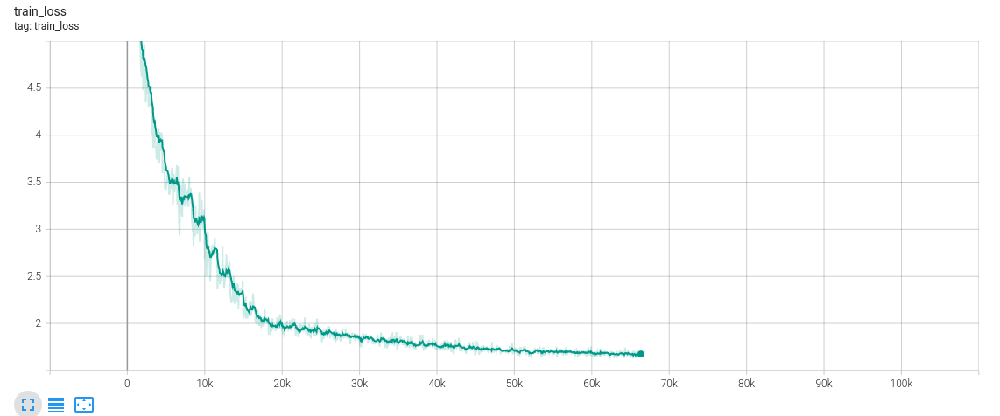
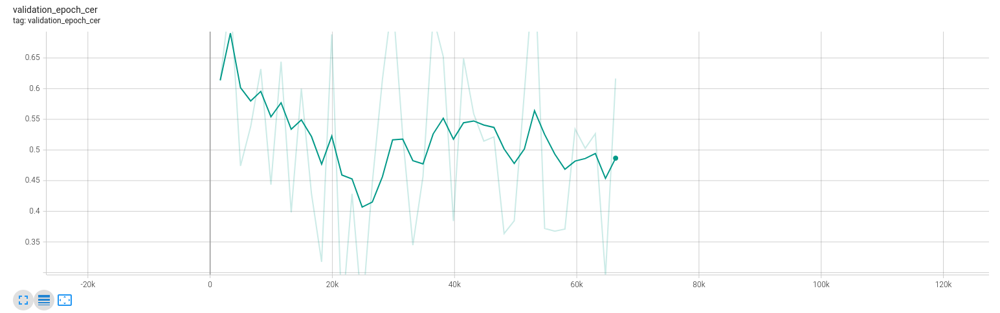
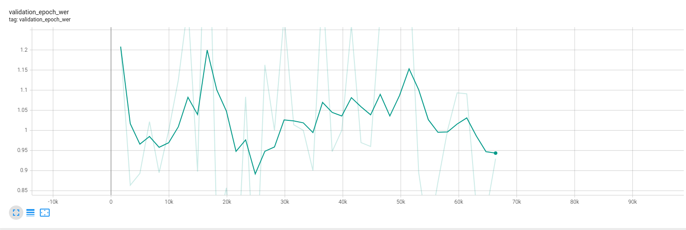
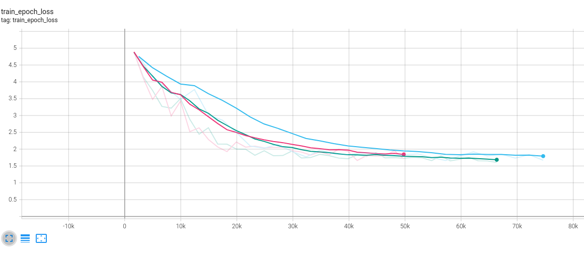

# ERA V1 Sessions 14-16: Training a Transformer architecture end to end

In this notebook, we demonstrate a transformer model built and trained from scratch to perform English to French and English to Italian translations. The transformer model follows an encoder-decoder architecture based on the original [paper](https://arxiv.org/abs/1706.03762) titled "Attention is all you need". The image below shows the model architecture.

In this model, we train the transformer model on two different datasets. In the notebook [S15_pl_lightning.ipynb](https://github.com/jyanivaddi/ERA_V1/blob/master/session_15/S15_pl_lightning.ipynb), we build the model and train it a little on the English-Italian translation dataset. In the notebook [S15_pl_lightning_En_Fr.ipynb](https://github.com/jyanivaddi/ERA_V1/blob/master/session_15/S15_pl_lightning_En_Fr.ipynb), we train the same model with a few performance enhancements but instead train on the English - French dataset. In the sections below, we discuss the performance enhancements in detail. 

For the English-Italian dataset, we got a training loss of 2.75 in 10 epochs of training, and for the English-French dataset, the same was 1.67 in 40 epochs of training. 

## Code Links
* The entire source code for the transformer model can be found [here](https://github.com/jyanivaddi/dl_hub/tree/main/Transformer).
* The files [PL_data_module.py](https://github.com/jyanivaddi/dl_hub/blob/main/Transformer/PL_data_module.py) ,[PL_model.py](https://github.com/jyanivaddi/dl_hub/blob/main/Transformer/PL_model.py), and [PL_main.py](https://github.com/jyanivaddi/dl_hub/blob/main/Transformer/PL_main.py) contain the pytorch lightning code.
* The file [config.py](https://github.com/jyanivaddi/dl_hub/blob/main/Transformer/config.py) contains the configuration parameters for the model.
* The files  [model.py](https://github.com/jyanivaddi/dl_hub/blob/main/Transformer/model.py), [dataset.py](https://github.com/jyanivaddi/dl_hub/blob/main/Transformer/dataset.py) contain the pytorch model definitions, and the dataset definitions. 
* The [OpusBooks](https://huggingface.co/datasets/opus_books) dataset from HuggingFace was used to train the model.
* The model is hosted as HuggingFace spaces and is available [here](https://huggingface.co/spaces/jvaddi/en_fr_translation).


## Performance Enhancements
In order to improve the accuracy, we add the following modifications to the model:
* Since there are some corrupted sentences in the English-French language in the OpusBooks dataset, we perform a preprocessing step where we filter out data samples for which the English language sentences are longer than 150 tokens. Additionally, we also filter out train samples where the French sentences are longer than English sentence by 10 words.
* To reduce the processing time and reduce the computational cost, we perform [dynamic batching](https://www.kaggle.com/code/rhtsingh/speeding-up-transformer-w-optimization-strategies)  during training. In this process, instead of fixing the size of padding for all the samples, we pad all train samples according to the longest sentence in that batch.
* We also implement the [parameter sharing](https://arxiv.org/pdf/2104.06022.pdf) to reduce the model size and improve performance.
* We varied the size of the hidden layer in the feed forward network from 2048, 1024, and 512 and observed a significant reduction in model parameters while also achieving similar train loss. Reducing the number of model parameters has enabled to increase the batch size and therefore model converged faster. 
  
## Optimizer and Scheduler
We use OneCycleLR scheduler with the following parameters to train the model:

```
scheduler = OneCycleLR(
    optimizer,
    max_lr=1E-04,
    steps_per_epoch=len(train_data_loader),
    epochs=40,
    pct_start=0.125,
    div_factor=10,
    three_phase=True,
    final_div_factor=10,
    anneal_strategy='linear'
)
```
We use Adam optimizer, along with CrossEntropy loss to train this model. 


## Results
The image below shows the training loss per step over the 40 epochs of training. The loss started around 5.0 and by 40th epoch, has reached around 1.67


The image below shows the character error rate over the training process


The image below shows the word error rate over the training process


The image below shows the training loss over the raining process for three different run configurations. The plot in 'blue' was generated when training with a batch size of 32 with d_ff of 2048, the plot in purple was generated when training with batch size of 48 and d_ff of 512, and the plot in 'green' was generated when training with batch size of 48 with d_ff of 1024 and was trained for 40 epochs.




