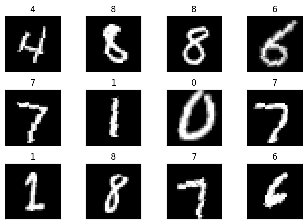
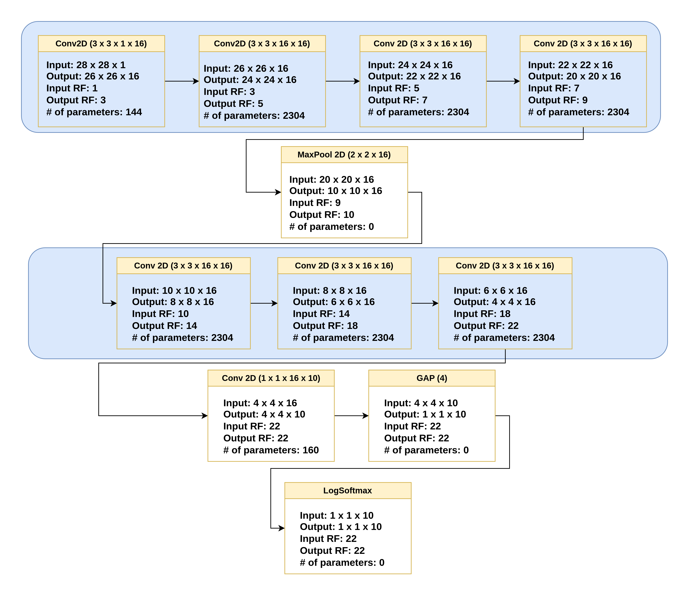
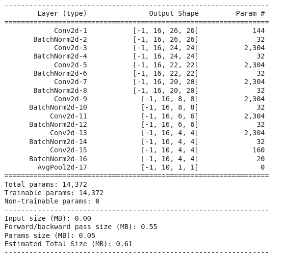
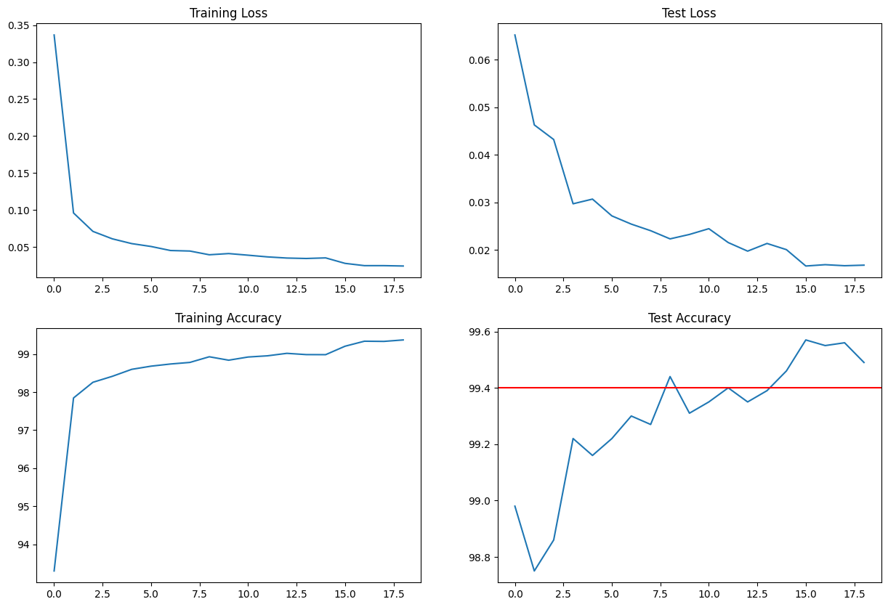
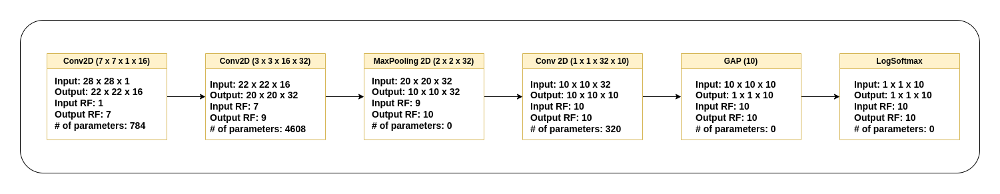
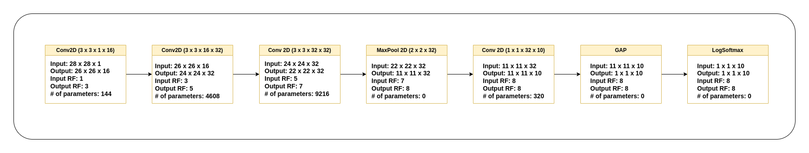
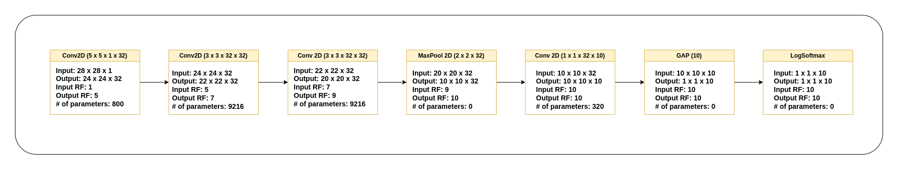

# ERA V1 Session 6 - Detecting handwritten digits under 20K parameters with an accuracy of 99.4%

## Contents

* [Introduction](#Introduction)
* [Model Architecture and performance](#ModelArchitecture)
* [Experiment Summary](#Summaryofotherexperiments)
* [Learnings and Takeaways](#Learnings&Takeaways)

## Introduction

In this session's assignment, I built a deep learning model to predict handwritten digits from the MNIST dataset. The model contains 14372 parameters and achieved the required test accuracy of 99.4% within 13 training epochs. The maximum test accuracy during the 20 epochs of training was 99.6%.
 
Below is a preview of the MNIST dataset. Each image is a single channel grayscale image containing a handwritten digit from 0 to 9 and is of size 28 x 28. 

## Model Architecture

After running several experiments, the details of which are explained in  [Experiment Summary](#summary-of-other-experiments), the following architecture was used to train the model.

### Model Summary
Here is a summary of the model architecture and the number of parameters. No bias terms were used in any of the layers. The model was trained for a total of 20 epochs. A maximum test accuracy of 99.57% was achieved. 

 

### Model Performance
The plots below show the train and test losses and accuracy achived during the 20 training epochs. 

Here are the concepts used and experimented with in this assignment: 
* __Number of output channels:__ To me, the biggest takeaway from this assignment was the number of output channels. I was able to get to the 99.4% without breaching the 20k limit only by keeping the maximum channels to 16. When I tried 32 and 64, the parameter count has exploded within 1-2 layers. I did not however, experiment with 8 channels. 
* __Dataset transformations:__ The train dataset was augmented by using  CenterCrop followed by resize, and RandomRotation transformations. 
* __How many layers:__ The model used a total of 11 layers to make the predictions.
* __MaxPooling:__ A single max pooling layer was used after the first four convolution blocks, when a RF of 9 was achieved.
* __1x1 Convolutions:__ Once the network achieved the maximum RF of 22, a 1 x 1 convolution was used to reduce the number of channels from 16 to 10.
* __3x3 Convolutions:__ A total of four successive 3 x 3 convolutions, each with 16 output channels and stride of 1 were used in the first block. In the second block, three more 3 x 3 convolution blocks with 16 output channels were used after which a 1x1 convolution block was used to reduce the channel count. 
* __Receptive Field:__ The maximum Receptive field achived by the network was 22. In prior experiments, he maximum receptive field never reached beyond 10 and the network could not go beyond 98.3% accuracy. 
* __SoftMax:__ Softmax layer was used in the end to calculate the prediction likelihood of all classes.
* __Learning Rate:__ A learning rate of 0.01 was used, which was reduced to 0.001 after the 15th epoch. I noticed that around 13th epoch, the network accuracy was reaching a plateau and fluctuating and so added the 10% drop post which the accuracy increased again.
* __Kernels and how do we decide the number of kernels?:__ Initially, I experimented with 7 x 7 and 5 x 5 kernels but saw that the network was not achieving good receptive field without hitting the 20k parameter ceiling. However, I did not observe any major performance hit with the larger kernels. This may be the case because of the smaller dataset size.
* __Batch Normalization:__ I used batch normalization after each convolution block untill the GAP layer. In my experiments, I saw an increase in accuracy from 98.1% to 98.5% by adding batch normalization. 
* __Image Normalization:__ The entire dataset was normalized by the mean of 0.1307 and std of 0.3081.  
* __Position of MaxPooling:__ I applied MaxPooling after the first 4 convolution blocks to downsample the image size from 20 x 20 to 10 x 10. I found it sufficient to use a single max pooling layer since I did not use strided convolutions at the beginning and the image size was progressively reducing.  
* __Position of Transition Layer:__ Instead of a FC layer, I used a 1 x 1 convolution layer to change the number of channels from 16 to 10. I used this just prior to the GAP layer. 
* __DropOut:__ Dropout should be used when there is overfitting occuring in the network. Overfitting means that the network has good accuracy on train data but does poorly on test data. In my case, the train and test accuracy were very close to each other and so I did not see any overfitting occuring. So I did not use dropout in my network.
* __The distance of MaxPooling from Prediction:__ The only max pooling layer I used was 5 layers away from the output. I did not experiment by moving the maxpooling layer closer in the final architecture. In the previous architectures I tried, the maxpooling was only 1-2 layers away from the output and the network did not go beyond 98.75%.
* __The distance of Batch Normalization from Prediction:__ I used batch norm till the final GAP layer. I also tested the network by removing the last batch norm but the result did not change. 
* __When do we stop convolutions and go ahead with a larger kernel or other alternative:__ Since I did not use strided convolutions (other than the maxpooling), I moved from convolution to 1 x 1 convolution when the image size got reduced to 4x4.
* __How do we know our network is not going well, comparatively, very early:__ In all the experiments, the model was converging, albeit slowly and reached maximum accuracy of atleast ~97% in each case. If I had noticed divergence, I would have stopped and changed the model.
* __Batch Size, and Effects of batch size:__ Kept the batch size constant at 128.

## Summary of other experiments

 
I tested several model architectures and model configurations prior to getting the stipulated accuracy and below  is a summary of all the experiments and the performance achieved. I realized that none of these networks worked well since the RF was too low and the network too shallow. Having 32 output channels in the network is making the model significantly heavy and making me to exhaust the 20k parameter limit. When I tried to limit the max channels to 16, I was able to add several more layers and get to much higher RF without breaching the parameter limit.

### Architecture 1: Max. accuracy: 98.1%
Num parameters: 5828   
Max. RF: 10

### Architecture 2: Max. accuracy: 98.5%
Num parameters: 14468  
 Max. RF: 8

### Architecture 3: Max. accuracy 98.75%
Num parameters: 19764   
Max. RF: 10

## Learnings & Takeaways
Following is a summary of my learnings from this assignment:
* The importance of network depth and receptive field in the DL model. 
* If the model is getting stuck at a local minima, we must change the learning rate so that it can converge and make progress towards the optimal cost.
* Batch Normalization does improve the accuracy of the model 

