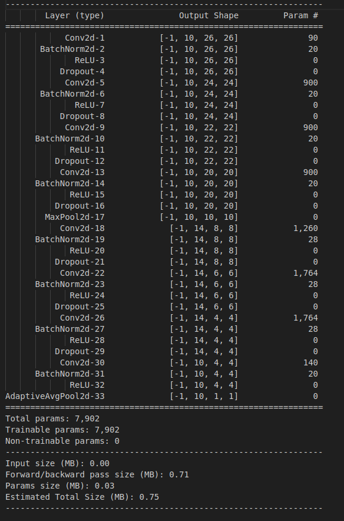
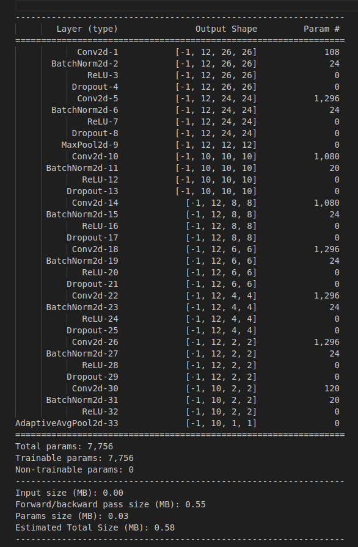

# ERA V1 Session 7 - Coding Practice

## Contents
* [Introduction](#Introduction)
* [Step 1: Model Set up](#Step-1-Model-SetUp-And-Skeleton)
* [Step 2: Optimizing Model Skeleton](#Step-2-Optimizing-Model-Skeleton)
* [Step 3: Optimizing Model Performance](#Step-3-Optimizing-Model-Performance)
* [Conclusion and Takeaways](#Conclusion-And-Takeaways)

# Introduction

In this exercise, we build several iterations of a neural network to progressively achieve a test accuracy of 99.4% (for atleast two successive epochs) within 15 epochs of training. The model should not have more than 8000 parameters. 

 I got the target accuracy within the constraints after 6 iterations. The following sections summarize each model iteration and the corresponding results.

# Step 1: Model SetUp And Skeleton

In this step we set up the basic building blocks of the model, define the structure, and get the model up and running. 
We do this in one iteration as shown below: 

## Iteration 1 

__Link to the ipynb notebook: [here](./code_model_1.ipynb)__
### Target:
* Set up the code structure
* Build data loader
* set up basic train, and test loop
* set up optimizer

### Result:
* __Max training accuracy (in 15 epochs): 88.23%__
* __Max test accuracy (in 15 epochs): 88.26%__
* Num parameters: 9178 

### Analysis:
*  Training accuracy has platueaed at around 87 by 4th epoch and has not increased
* I need to improve the update the model skeleton to get better results before tuning the model for performance.

# Step 2: Optimizing Model Skeleton

 Now that our model is up and running, time to optimize the skeleton. In the architectures that I tried, I had two convolution blocks separated by a max pooling block. The first set of convolution blocks had 10 output channels and the second set of blocks had 16 output channels which were then passed through an adaptive average pooling layer followed by softmax. The iterations are described below: 

## Iteration 2 

__Link to the ipynb notebook: [here](./code_model_2.ipynb)__
### Target:
* The previous model had achieved an RF of 20 and had ~87% accuracy. In this model,I tried to increase the RF to 22 and slightly reduce the parameter count.
* Instead of progressively increasing and then decreasing the channel count, in this model, I had kept the channel count constant at 10 and 16 in two convolution blocks.

### Results:
* Num parameters: 8998
* Max RF: 22
* __Max train accuracy (in 15 epochs): 98.4%__
* __Max test accuracy (in 15 epochs): 98.2%__

### Analysis:
*  The train accuracy started off very low (< 20%) and increased to 90% in the 3rd epoch.
* Till the 10th epoch, the test accuracy was consistently higher than the train accuracy but after that the train accuracy increased disproportionately. This suggests that after 11th epoch, the model started to overfit.

## Iteration 3 

__Link to the ipynb notebook: [here](./code_model_3.ipynb)__

### Target:
* Reduce overfitting by adding Batch Normalization to every convolution block till the Adaptive Average Pool layer

### Result:
* Num parameters: 9194
* Max RF: 22
* __Max Train accuracy (in 15 epochs): 99.4%__
* __Max test accuracy (in 15 epochs): 99.4%__

### Analysis:
*  Compared the previous model, the magnitude of overfit has considerably reduced.
* The training accuracy is plateauing at 99.4% after epoch 14.
* The model still has ~ 1200 more parameters than the desired target so I need to fix that in the next model iteration.

##  Iteration 4 

__Link to the ipynb notebook: [here](./code_model_4.ipynb)__

### Target:
* Reduce the number of parameters while trying to maintain the accuracy.
* I removed an extra layer at the end by making one of the convolutions from 16 to 10 channels and getting rid of the 1x1 convolution block.

### Result:
* Num parameters: 7218
* Max RF: 20
* __Max Train accuracy (in 15 epochs): 99.25%.__
* __Max test accuracy (in 15 epochs): 99.0%__

### Analysis:
*  Compared the previous model, even though a layer of convolution was removed, the fall in accuracy was not drastic. Now the parameters are within the target criteria.
* There is still some overfitting occuring after epoch 15. Need to add dropout to improve it.

# Step 3: Optimizing Model Performance

In the previous step, I was able to get to the desired accuracy within the 15th epoch, albeit with higher parameters. In this step, I tried to get to the desired accuracy while staying below the 8000 parameter limit. In order to reduce the parameters, I changed the output channels in the 2nd convolution blocks from 16 to 14 and added more layers before the prediction layer to improve the RF from 20 to 22. Subsequently, I further reduced the number of output channels to 12 in both the first and second block and added more layers to further increase the RF to 26. Eventually at the 6th iteration, the model has achieved the final accuracy of 99.4% as shown in the plots below. 

## Iteration 5 

__Link to the ipynb notebook: [here](./code_model_5.ipynb)__

### Target:
* Increase model capacity by adding more convolution layers and reducing the output channels from 16 to 14. 
* Add LR scheduler

### Result:
* Num parameters: 7902
* Max RF: 22
* __Max Train accuracy (in 15 epochs): 98.87%.__
* __Max test accuracy (in 15 epochs): 99.25%__

### Analysis:
*  Increasing model capacity has improved the accuracy but it has not yet reached the target. 

## Iteration 6 

__Link to the ipynb notebook: [here](./code_model_6.ipynb)__

### Target:
* Move maxpool at RF 5 instead of 9.
* Add image augmentations by adding random rotation
* Add step LR scheduler after 8th epoch

### Result:
* Num parameters: 7756
* Max RF: 26
* __Max Train accuracy (in 15 epochs): 98.14%__
* __Max test accuracy (in 15 epochs): 99.43%__

### Analysis:
* By moving maxpool earlier, the overall RF has become 26 compared to 22 in the previous iteration. 
* Additionally, adding the scheduler helped improve the model test accuracy to 99.4% 
* The desired target of 99.4% accuracy was achieved around 8th epoch and has since maintained the accuracy rate as seen in the plots above.

# Conclusion And Takeaways
* The model was able to achieve the 99.4% test accuracy only when the RF was atleast 22. 
* In order to get a RF of 26 while keeping the number of parameters under 8000, the number of output convolution channels was reduced from 16 to 12 eventually.
* When the accuracy and loss reached a plateau, adding a scheduler helps to improve the metrics.
* Dropout and batchnorm were used to reduce the overfitting. 