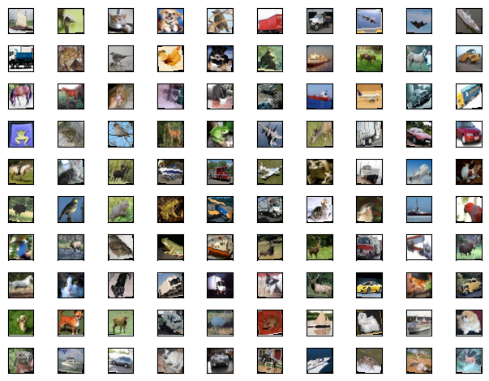
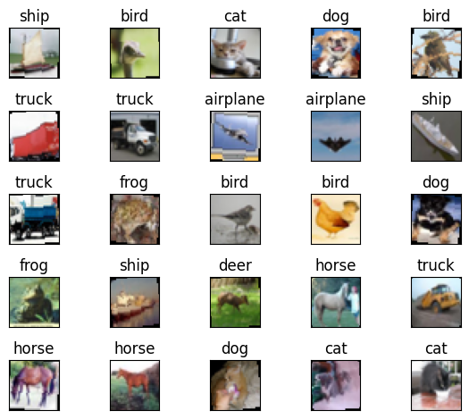
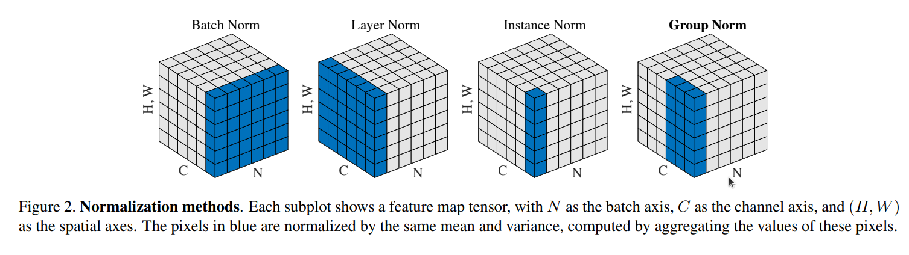

# ERA V1 Session 8 - Building an Image Classifier on CIFAR-10 Dataset

## Contents
* [Introduction](#Introduction)
* [Dataset](#Dataset)
* [Model](#Model)
* [Normalization Methods](#Normalization)
* [Results](#Results)

# Introduction
<p>In this module, we build a CNN model to perform image classificaion on the CIFAR-10 dataset. We also explore the effect of using batch normalization, layer normalization, and group normalization on the model performance. We demonstrate how the classifier can reach 70% accuracy in under 20 epochs using each normalization method while using less than 50000 model parameters. </p>

# Dataset
The dataset we use in this notebook is called **[CIFAR-10](https://www.cs.toronto.edu/~kriz/cifar.html)**. This dataset consists of 60000 RGB images of size 32 x 32. There are a total of 10 classes and 6000 images per class. There are 50000 training images and 10000 test images. we set the batch size to 128 during training so there are 391 batches of images per epoch. 

The images below show some representative images from the dataset


The following images show few more samples, along with their labels


## Computing mean and standard deviation of the dataset
The following code snippet shows how to compute the mean and standard deviation of the cifar-10 dataset. The mean RGB values are: (0.491, 0.482, 0.447), and the std of the pixel values are: (0.247, 0.244, 0.262) where the tuple represents the three image channels. Do note that the dataset is first standardized from 0-255 to 0-1 using the ```ToTensor``` transformation in pytorch prior to normalization. 
```
mean_r = 0
mean_g = 0
mean_b = 0

std_r = 0
std_g = 0
std_b = 0
loader_for_stats = train_loader
for img,_ in tqdm(loader_for_stats):
    img = np.asarray(img)
    # calculate Mean of Normalized dataset
    mean_r += np.mean(img[:,0,:,:])
    mean_g += np.mean(img[:,1,:,:])
    mean_b += np.mean(img[:,2,:,:])
    # calculate std of Normalized dataset
    std_r += np.var(img[:,0,:,:])
    std_g += np.var(img[:,1,:,:])
    std_b += np.var(img[:,2,:,:])
mean_r = mean_r / len(loader_for_stats)
mean_g = mean_g / len(loader_for_stats)
mean_b = mean_b / len(loader_for_stats)
std_r = np.sqrt(((1./(len(loader_for_stats)-1))*std_r))
std_g = np.sqrt(((1./(len(loader_for_stats)-1))*std_g))
std_b = np.sqrt(((1./(len(loader_for_stats)-1))*std_b))
print(f"dataset mean: {mean_r:0.3f}, {mean_g:0.3f}, {mean_b:0.3f}")
print(f"dataset std: {std_r:0.3f}, {std_g:0.3f}, {std_b:0.3f}")
```

## Image Augmentations
Apart from the normalization, two additional transformations were used to generate augmented images. [RandomHorizontalFlip](https://pytorch.org/vision/main/generated/torchvision.transforms.RandomHorizontalFlip.html) randomly flips the image horizontally at a probability of 10%, and [RandomRotation](https://pytorch.org/vision/main/generated/torchvision.transforms.RandomRotation.html) randomly rotates the images in the range of [-10&deg;, 10&deg;] with a probability of 10%.   

We experimented with another image transformation called [RandomResizedCrop](https://pytorch.org/vision/main/generated/torchvision.transforms.RandomResizedCrop.html#torchvision.transforms.RandomResizedCrop). This transformation crops a random region of the image and resizes back to the original dimensions. However, using this transformation, the model was not able to complete training in 20 epochs and was giving a maximum train and test accuracies of ~60%. Since our target is to achieve 70% accuracy in 20 epochs, we do not use this tranformation in the actual model.Perhaps by tuning the optimizer appropriately, it is possible to include this augmentation and still achieve 70% validation accuracy but lets not pursue that path yet!


# Model
We build a CNN based on the squeeze and expand architecture in this task. The convolution sequence is:

```C1 C2 c3 P1 C3 C4 C5 c6 P2 C7 C8 C9 AAP c10```<br>
where ```C``` represents a 3 x 3 convolution block, ```c``` represents a 1 x 1 convolution block, ```P``` represents a 2 x 2 maxpooling block, and ```AAP``` represents an Adaptive Average Pooling block. The model contains a total of 46064 parameters. The model achieved a max. receptive field of 44 for the cifar-10 input data of size 3 x 32 x 32. 

## Regularization
A uniform drop out value of 2% was used in all the convolution blocks except the final 1 x 1 convolution to prevent overfitting to the train set. Additionally, data transformations mentioned in the Dataset section were implemtented to augment the dataset. 

## Model Summary
Here is a summary of the model we used to perform classification. 
```
----------------------------------------------------------------
        Layer (type)               Output Shape         Param #
================================================================
            Conv2d-1           [-1, 16, 32, 32]             432
       BatchNorm2d-2           [-1, 16, 32, 32]              32
              ReLU-3           [-1, 16, 32, 32]               0
           Dropout-4           [-1, 16, 32, 32]               0
            Conv2d-5           [-1, 32, 32, 32]           4,608
       BatchNorm2d-6           [-1, 32, 32, 32]              64
              ReLU-7           [-1, 32, 32, 32]               0
           Dropout-8           [-1, 32, 32, 32]               0
            Conv2d-9           [-1, 16, 32, 32]             512
      BatchNorm2d-10           [-1, 16, 32, 32]              32
             ReLU-11           [-1, 16, 32, 32]               0
          Dropout-12           [-1, 16, 32, 32]               0
        MaxPool2d-13           [-1, 16, 16, 16]               0
           Conv2d-14           [-1, 32, 16, 16]           4,608
      BatchNorm2d-15           [-1, 32, 16, 16]              64
             ReLU-16           [-1, 32, 16, 16]               0
          Dropout-17           [-1, 32, 16, 16]               0
           Conv2d-18           [-1, 32, 16, 16]           9,216
      BatchNorm2d-19           [-1, 32, 16, 16]              64
             ReLU-20           [-1, 32, 16, 16]               0
          Dropout-21           [-1, 32, 16, 16]               0
           Conv2d-22           [-1, 32, 16, 16]           9,216
      BatchNorm2d-23           [-1, 32, 16, 16]              64
             ReLU-24           [-1, 32, 16, 16]               0
          Dropout-25           [-1, 32, 16, 16]               0
           Conv2d-26           [-1, 16, 16, 16]             512
      BatchNorm2d-27           [-1, 16, 16, 16]              32
             ReLU-28           [-1, 16, 16, 16]               0
          Dropout-29           [-1, 16, 16, 16]               0
        MaxPool2d-30             [-1, 16, 8, 8]               0
           Conv2d-31             [-1, 16, 8, 8]           2,304
      BatchNorm2d-32             [-1, 16, 8, 8]              32
             ReLU-33             [-1, 16, 8, 8]               0
          Dropout-34             [-1, 16, 8, 8]               0
           Conv2d-35             [-1, 32, 6, 6]           4,608
      BatchNorm2d-36             [-1, 32, 6, 6]              64
             ReLU-37             [-1, 32, 6, 6]               0
          Dropout-38             [-1, 32, 6, 6]               0
           Conv2d-39             [-1, 32, 4, 4]           9,216
      BatchNorm2d-40             [-1, 32, 4, 4]              64
             ReLU-41             [-1, 32, 4, 4]               0
          Dropout-42             [-1, 32, 4, 4]               0
AdaptiveAvgPool2d-43             [-1, 32, 1, 1]               0
           Conv2d-44             [-1, 10, 1, 1]             320
================================================================
Total params: 46,064
Trainable params: 46,064
Non-trainable params: 0
----------------------------------------------------------------
Input size (MB): 0.01
Forward/backward pass size (MB): 3.00
Params size (MB): 0.18
Estimated Total Size (MB): 3.18
----------------------------------------------------------------
```
## Optimizer
For this model, we used Stochastic Gradient Descent optimizer with negative log likelihood loss function at an initial learning rate of 0.1. A StepLR scheduler was used to reduce the learning rate by 10% every 8 epochs. The model was trained for 19 epochs. 

# Feature Normalization
One of the key steps in any deep learning model is to use feature normalization between successive convolution operations. In feature normalization, the output of a convolution block is normalized to a Gaussian distribution of mean 0 and standard deviation 1 prior to performing the next convolution operation. This process ensures that feature maps (and gradients) dont explore as more layers are added. 

Three different normalization methods were implemented in the model and we walk through each method below:


## Batch Normalization
Here, normalization is performed over all the batch features of a single channel. 