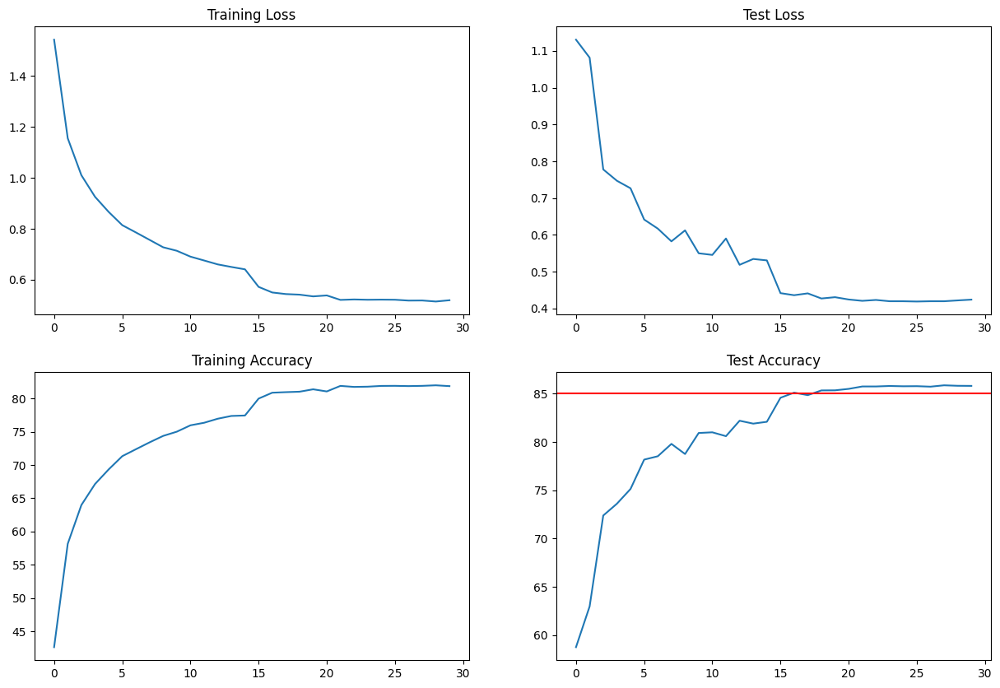

# ERA V1 Session 9 - Advanced Convolutions

## Contents
* [Introduction](#Introduction)
* [Dataset](#Dataset)
* [Model](#Model)
* [Convolutions](#Convolutions)
* [Results](#Results)
* [Learnings](#Learnings)

# Introduction
<p>In this module, we build a CNN model to perform image classificaion on the CIFAR-10 dataset. Along the way we build intuition on dilated convolutions and depth-wise separable convolutions. We demonstrate how using dilated and depth-wise convolutions, the classifier can achieve 85% accuracy in under 20 epochs even without a single maxpooling or a stride-2 convolution in the network. The model has 171840 parameters.


# Dataset
The dataset we use in this notebook is called **[CIFAR-10](https://www.cs.toronto.edu/~kriz/cifar.html)**. This dataset consists of 60000 RGB images of size 32 x 32. There are a total of 10 classes and 6000 images per class. There are 50000 training images and 10000 test images. we set the batch size to 128 during training so there are 391 batches of images per epoch. 

The images below show some representative images from the dataset


The following images show few more samples, along with their labels


## Image Augmentations using Albumentations library
Image augmentations are used in order to increase the dataset size and as a way of inproving model regularization. By transforming the dataset arbitrarily we ensure that the network does not memorize the train dataset. In our model, we use  [Albumentations](https://albumentations.ai/) library for implementing various image augmentations. The library contains several augmentation methods and it seamlessly integrates with Pytorch. 

The three different image transformation methods we use in this model are:

* HorizontalFlip: This method randomly flips an image horizontally 
* ShiftScaleRotate: This method shifts, scales, or rotates the image 
* Cutout: This method randomly cuts out a square of size 16 x 16 in the image. 

The below image demonstrates how the image transforms look on a sample image


# Model
Our model contains four convolution blocks, each of which has three convolution layers. The output from the fourth block is passed through an adaptive average pooling layer, followed by a 1x1 convolution to reduce the number of output channels to 10. Finally log softmax function is used to calculate the class probabilities.

```B1-> B2 -> B3 -> B4 -> AAP -> C5 -> O```  is the model structure 
where ```B``` represents a convolution block of three layers, ```C``` represents a 1 x 1 convolution block, ```AAP``` represents an Adaptive Average Pooling block, and ```O``` indicates the log softmax output. The model contains a total of 171840 parameters. The model achieved a max. receptive field of 77 for the cifar-10 input data of size 3 x 32 x 32. 

Each block ```B``` contains the following layers:

**Layer 1**: 3D convolution with kernel size of 3 

**Layer 2**: Depthwise separable convolution

**Layer 3**: Dilated convolution


The receptive field computations for this model are shown below:


<!--## Dilated Convolution
In dilated convolution, the kernel size is effectively increased by using alternate 


## Regularization
A uniform drop out value of 5% was used in all the convolution blocks except the final 1 x 1 convolution to prevent overfitting to the train set. 

Feature normalization is performed using batch normalization at each convolution layer

Additionally, data transformations mentioned in the Dataset section were implemtented to augment the dataset. 
-->

## Model Summary
Here is a summary of the model we used to perform classification. 

```
----------------------------------------------------------------
        Layer (type)               Output Shape         Param #
================================================================
            Conv2d-1           [-1, 64, 32, 32]           1,728
       BatchNorm2d-2           [-1, 64, 32, 32]             128
              ReLU-3           [-1, 64, 32, 32]               0
           Dropout-4           [-1, 64, 32, 32]               0
            Conv2d-5           [-1, 64, 32, 32]             576
       BatchNorm2d-6           [-1, 64, 32, 32]             128
              ReLU-7           [-1, 64, 32, 32]               0
           Dropout-8           [-1, 64, 32, 32]               0
            Conv2d-9           [-1, 64, 32, 32]           4,096
           Conv2d-10           [-1, 64, 32, 32]          36,864
      BatchNorm2d-11           [-1, 64, 32, 32]             128
             ReLU-12           [-1, 64, 32, 32]               0
          Dropout-13           [-1, 64, 32, 32]               0
           Conv2d-14           [-1, 64, 32, 32]          36,864
      BatchNorm2d-15           [-1, 64, 32, 32]             128
             ReLU-16           [-1, 64, 32, 32]               0
          Dropout-17           [-1, 64, 32, 32]               0
           Conv2d-18           [-1, 64, 32, 32]             576
      BatchNorm2d-19           [-1, 64, 32, 32]             128
             ReLU-20           [-1, 64, 32, 32]               0
          Dropout-21           [-1, 64, 32, 32]               0
           Conv2d-22           [-1, 64, 32, 32]           4,096
           Conv2d-23           [-1, 64, 32, 32]          36,864
      BatchNorm2d-24           [-1, 64, 32, 32]             128
             ReLU-25           [-1, 64, 32, 32]               0
          Dropout-26           [-1, 64, 32, 32]               0
           Conv2d-27           [-1, 32, 30, 30]          18,432
      BatchNorm2d-28           [-1, 32, 30, 30]              64
             ReLU-29           [-1, 32, 30, 30]               0
          Dropout-30           [-1, 32, 30, 30]               0
           Conv2d-31           [-1, 32, 28, 28]             288
      BatchNorm2d-32           [-1, 32, 28, 28]              64
             ReLU-33           [-1, 32, 28, 28]               0
          Dropout-34           [-1, 32, 28, 28]               0
           Conv2d-35           [-1, 32, 28, 28]           1,024
           Conv2d-36           [-1, 32, 28, 28]           9,216
      BatchNorm2d-37           [-1, 32, 28, 28]              64
             ReLU-38           [-1, 32, 28, 28]               0
          Dropout-39           [-1, 32, 28, 28]               0
           Conv2d-40           [-1, 32, 26, 26]           9,216
      BatchNorm2d-41           [-1, 32, 26, 26]              64
             ReLU-42           [-1, 32, 26, 26]               0
          Dropout-43           [-1, 32, 26, 26]               0
           Conv2d-44           [-1, 32, 24, 24]             288
      BatchNorm2d-45           [-1, 32, 24, 24]              64
             ReLU-46           [-1, 32, 24, 24]               0
          Dropout-47           [-1, 32, 24, 24]               0
           Conv2d-48           [-1, 32, 24, 24]           1,024
           Conv2d-49           [-1, 32, 24, 24]           9,216
      BatchNorm2d-50           [-1, 32, 24, 24]              64
             ReLU-51           [-1, 32, 24, 24]               0
          Dropout-52           [-1, 32, 24, 24]               0
AdaptiveAvgPool2d-53             [-1, 32, 1, 1]               0
           Conv2d-54             [-1, 10, 1, 1]             320
================================================================
Total params: 171,840
Trainable params: 171,840
Non-trainable params: 0
----------------------------------------------------------------
Input size (MB): 0.01
Forward/backward pass size (MB): 17.53
Params size (MB): 0.66
Estimated Total Size (MB): 18.19
----------------------------------------------------------------
```

## Optimizer
For this model, we used Stochastic Gradient Descent optimizer with negative log likelihood loss function at an initial learning rate of 0.1. 

A learning rate scheduler called [ReduceLROnPleateau](https://pytorch.org/docs/stable/generated/torch.optim.lr_scheduler.ReduceLROnPlateau.html) was used to automatically adjust the learning rate based on the model performance. The scheduler was changes the learning rate to 10% of the current rate when the test loss hasn't reduced by atleast 0.1 over the previous 4 epochs.

Figure below shows how the learning rate varied from a starting value of 0.01 over 30 epochs of training.


# Results

**The model was run for 30 epochs and has achieved a maximum validation accuracy of 85.87**. The table below shows the training log over 30 epochs.
<!--
```
Epoch	     Train Loss	       Val Loss      Train Accuracy    Val Accuracy
============================================================================
   1     		1.54		      1.13		      42.64		      58.74
   2     		1.16		      1.08		      58.16		      62.96
   3     		1.01		      0.78		      63.98		      72.38
   4     		0.93		      0.75		      67.14		      73.60
   5     		0.87		      0.73		      69.33		      75.13
   6     		0.81		      0.64		      71.32		      78.17
   7     		0.79		      0.62		      72.37		      78.52
   8     		0.76		      0.58		      73.40		      79.80
   9     		0.73		      0.61		      74.37		      78.75
   10     		0.71		      0.55		      75.00		      80.93
   11     		0.69		      0.55		      75.96		      81.00
   12     		0.68		      0.59		      76.34		      80.60
   13     		0.66		      0.52		      76.95		      82.20
   14     		0.65		      0.53		      77.36		      81.90
   15     		0.64		      0.53		      77.43		      82.09
   16     		0.57		      0.44		      79.97		      84.58
   17     		0.55		      0.44		      80.86		      85.11
   18     		0.54		      0.44		      80.94		      84.85
   19     		0.54		      0.43		      81.01		      85.34
   20     		0.53		      0.43		      81.37		      85.35
   21     		0.54		      0.42		      81.05		      85.50
   22     		0.52		      0.42		      81.88		      85.75
   23     		0.52		      0.42		      81.73		      85.75
   24     		0.52		      0.42		      81.76		      85.80
   25     		0.52		      0.42		      81.88		      85.77
   26     		0.52		      0.42		      81.89		      85.78
   27     		0.52		      0.42		      81.85		      85.73
   28     		0.52		      0.42		      81.89		      85.87
   29     		0.51		      0.42		      81.97		      85.82
   30     		0.52		      0.42		      81.85		      85.81
===========================================================================


```
-->
```
Epoch	     Train Loss     Val Loss     Train Accuracy %    Val Accuracy %
========================================================================
1		1.54		1.13		42.64		58.74

2		1.16		1.08		58.16		62.96

3		1.01		0.78		63.98		72.38

4		0.93		0.75		67.14		73.60

5		0.87		0.73		69.33		75.13

6		0.81		0.64		71.32		78.17

7		0.79		0.62		72.37		78.52

8		0.76		0.58		73.40		79.80

9		0.73		0.61		74.37		78.75

10		0.71		0.55		75.00		80.93

11		0.69		0.55		75.96		81.00

12		0.68		0.59		76.34		80.60

13		0.66		0.52		76.95		82.20

14		0.65		0.53		77.36		81.90

15		0.64		0.53		77.43		82.09

16		0.57		0.44		79.97		84.58

17		0.55		0.44		80.86		85.11

18		0.54		0.44		80.94		84.85

19		0.54		0.43		81.01		85.34

20		0.53		0.43		81.37		85.35

21		0.54		0.42		81.05		85.50

22		0.52		0.42		81.88		85.75

23		0.52		0.42		81.73		85.75

24		0.52		0.42		81.76		85.80

25		0.52		0.42		81.88		85.77

26		0.52		0.42		81.89		85.78

27		0.52		0.42		81.85		85.73

28		0.52		0.42		81.89		85.87

29		0.51		0.42		81.97		85.82

30		0.52		0.42		81.85		85.81

=========================================================================

```
The plots below show accuracy and loss computation over 19 epochs of training using all the three normalization methods described above. In our model, we used the group norm with 2 groups. 




Below figures shows some examples of incorrect predictions the model made in all the three normalization configurations. In each image, the first class indicates the ground truth and the second indicates the model prediction. 

 

# Learnings
Some takeaways from this exercise:
* Dilated convolutions can enhance the receptive field without compromising on the spatial resolution. These can be used in place of max pooling or strided convolutions.
* Depthwise separable convolutions are a great tool to reduce the number of parameters while maitaining the capacity. As can be seen in the model, it is far easier to add 64 channel convolutions by using depthwise separable convolution while still keeping the total number of parameters under 200000. These are especially useful when working with limited infrastructure necessitates lighter models.
* Albumentations is a great library to incorporate augmentations in deep learning models. 